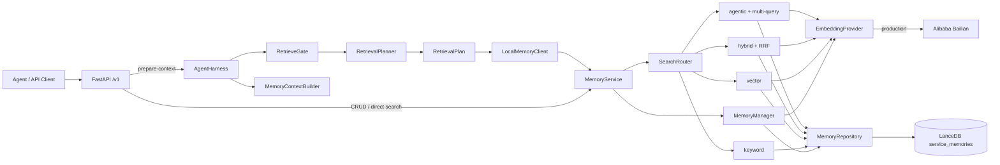

# Agent Memory Engine

Agent Memory Engine 是一个以 **FastAPI + LanceDB + Qwen3-VL Embedding** 为核心的 Agent 长期记忆实验项目。当前主线为 Stage 10：在 Memory Service 之上加入 `RetrieveGate`、`RetrievalPlanner` 与 `AgentHarness`，让 Agent 先判断是否需要历史记忆，再选择合适的检索策略并生成可直接注入提示词的上下文。

当前实现重点是可观察、可替换的检索流程，而不是一个已经完备的生产级记忆平台。

## 核心能力

- Memory 的创建、读取、更新、删除，以及按元数据过滤。
- `episodic`、`semantic`、`procedural`、`reflection`、`experience` 五类记忆。
- `keyword`、`vector`、`hybrid`、`agentic` 四种检索方法。
- 基于 RRF（Reciprocal Rank Fusion）的关键词/向量结果融合。
- Agent 侧的检索门控、检索计划、多查询合并和上下文字符预算。
- 默认通过阿里云百炼 `qwen3-vl-embedding` 生成向量；测试和离线开发可使用确定性 mock embedding。
- Stage 10 数据写入独立的 LanceDB `service_memories` 表，不与早期实验表混用。

## 架构

[打开可交互架构图](docs/agent-memory-engine.architecture.html) · [查看架构图规格](docs/agent-memory-engine.architecture.json)

交互图支持缩放、搜索、关系追踪、深浅主题和导出。下面的 Mermaid 图展开了应用内部的主要调用关系：



### 分层职责

| 层 | 主要模块 | 职责 |
|---|---|---|
| HTTP | `app/main.py`, `app/api/` | FastAPI 生命周期、请求校验、路由和响应 |
| Harness | `app/harness/` | 判断是否检索、生成 `RetrievalPlan`、执行计划并构造上下文 |
| Application | `app/application/` | 提供稳定用例入口；分离 CRUD 编排与检索路由 |
| Search | `app/memory/search/` | 选择 keyword/vector/hybrid/agentic pipeline，完成融合与多查询回退 |
| Domain | `app/domain/` | Memory、检索协议、抽象端口和枚举 |
| Adapters | `app/adapters/` | Qwen/mock embedding 等外部能力适配 |
| Infrastructure | `app/infrastructure/` | `MemoryRepository` 的 LanceDB 实现 |
| Storage | `storage/` | LanceDB 表 schema、表名和打开/创建逻辑 |

### Agent 上下文准备流程

`POST /v1/agent/prepare-context` 的执行顺序如下：

1. `RetrieveGate` 根据任务文本和可选项目上下文计算分数；低于 `0.35` 时直接跳过检索。
2. `RetrievalPlanner` 选择记忆类型、检索方法、最多 3 个查询、`top_k`、过滤条件和字符预算。
3. `LocalMemoryClient` 逐个执行查询，按 Memory ID 去重，并保留同一记忆的最高分结果。
4. `MemoryContextBuilder` 先按检索分数、再按 importance 排序，在预算内生成 `memory_context`。
5. API 返回 `gate_decision`、`retrieval_plan`、`memories` 和 `memory_context`，便于后续做 routing A/B Test。

`RetrieveGate` 只回答“要不要查”，`RetrievalPlanner` 只生成计划，`SearchRouter` 只选择检索 pipeline；这三个决策边界不会相互越权。

## 检索策略

| 方法 | 行为 | 适用场景 |
|---|---|---|
| `keyword` | 对中文友好的字符 2-gram 词法匹配，不调用 embedding | 错误码、ID、函数名、文件名等精确查询 |
| `vector` | 查询向量化后执行 LanceDB cosine vector search | 单纯语义相关查询 |
| `hybrid` | 扩大候选集后融合 vector 与 keyword 排名 | 默认的平衡检索 |
| `agentic` | 先做 `vector_anchored` hybrid；结果不足时进行确定性 query rewrite，再用 RRF 合并 | 复杂、跨主题或需要历史经验的任务 |

Hybrid 会根据记忆类型选择变体：

- 包含 `reflection` 或 `experience`：`vector_anchored`，语义结果获得更高权重。
- 仅包含 `procedural`：`skill_hybrid`，关键词和语义同等重要。
- 其他组合：`standard`。

当前 `agentic` 并不调用 LLM 规划查询，而是使用可重复测试的规则改写。`app/retrieval/pipeline.py` 和 reranker adapter 保留了早期 Stage 9 的实现，但 Stage 10 的依赖注入实际使用 `SearchRouter`，因此当前 HTTP 检索链路不执行 rerank。

## 快速开始

建议使用 Python 3.10 或更高版本。默认配置会调用百炼服务，需要有效凭证。

### Windows PowerShell

```powershell
python -m venv .venv
.\.venv\Scripts\Activate.ps1
python -m pip install -r requirements.txt
Copy-Item .env.example .env
python -m uvicorn app.main:app --reload
```

### Linux / macOS

```bash
python -m venv .venv
source .venv/bin/activate
python -m pip install -r requirements.txt
cp .env.example .env
python -m uvicorn app.main:app --reload
```

启动后可访问：

- Swagger UI：`http://127.0.0.1:8000/docs`
- OpenAPI JSON：`http://127.0.0.1:8000/openapi.json`
- 健康检查：`http://127.0.0.1:8000/v1/health`

> 根目录的 `python main.py` 目前仍指向 Stage 8 多模态演示，不是 HTTP 服务入口。启动 API 请使用 `app.main:app`。

## 配置

复制 `.env.example` 为 `.env` 后填写配置：

| 变量 | 默认值/示例 | 说明 |
|---|---|---|
| `DASHSCOPE_API_KEY` | `sk-...` | 使用 Qwen provider 时需要 |
| `BAILIAN_WORKSPACE_ID` | `llm-...` | 百炼 Workspace ID |
| `BAILIAN_REGION` | `cn-beijing` | 百炼区域 |
| `BAILIAN_BASE_URL` | 可选 | 覆盖自动生成的百炼 API 地址 |
| `QWEN_VL_EMBEDDING_MODEL` | `qwen3-vl-embedding` | Embedding 模型名 |
| `QWEN_VL_EMBEDDING_DIMENSION` | `1024` | Qwen 输出维度 |
| `MEMORY_DB_PATH` | `./database/lance` | Stage 10 LanceDB 目录 |
| `MEMORY_TABLE_NAME` | `service_memories` | Stage 10 专用表 |
| `EMBEDDING_PROVIDER` | `qwen` | 可选 `qwen` / `mock` |
| `EMBEDDING_DIM` | `1024` | fallback 和 mock embedding 维度 |
| `RERANKER_PROVIDER` | `qwen` | 当前 Stage 10 主链未使用，保留给旧 pipeline |
| `LLM_PROVIDER` | `deepseek` | CLI 用 `deepseek` 或 `kimi` |
| `LLM_API_KEY` | | DeepSeek / Kimi 的 API Key，仅 CLI 需要 |
| `LLM_BASE_URL` / `LLM_MODEL` | 按厂商默认 | 可覆盖兼容接口地址和模型名。Kimi K3 用 `kimi-k3`；国内 `api.moonshot.cn`，国际 `api.moonshot.ai`。thinking 模型不要设 temperature |
| `LOG_DIR` | `./logs` | 追踪日志目录（jsonl + 文本） |
| `AME_LOG_DISABLED` / `LOG_DISABLED` | `0` | `1`/`true` 时不写日志文件；从 `.env` 读取 |

日志写在项目根目录 `logs/`（jsonl + 文本）。pytest 默认不写文件。可用 `AME_LOG_DISABLED=1` 关闭（进程环境或项目根 `.env` 均可）。

## CLI 对话

不需要先启动 uvicorn。复用同一套 `service_memories` 与 Harness：

```powershell
python -m app.cli
```

常用命令：`/add reflection | ...`、`/debug`、`/compare`、`/nomem`、`/project harness`、`/quit`。

每轮会把 Gate → Plan → Search → Context → LLM 的事件写入 `logs/cli-*.jsonl`。

若要完全离线运行，可改用新的数据库目录，避免与现有 1024 维表冲突：

```dotenv
MEMORY_DB_PATH=./database/lance_mock
MEMORY_TABLE_NAME=service_memories
EMBEDDING_PROVIDER=mock
EMBEDDING_DIM=32
```

LanceDB 表的向量维度在创建时固定。服务启动时会校验现有表维度；切换模型或 mock 维度时，请使用新表或进行显式数据迁移。

## HTTP API

| 方法 | 路径 | 说明 |
|---|---|---|
| `GET` | `/v1/health` | 服务状态与当前 stage |
| `POST` | `/v1/memories` | 写入一条 Memory |
| `POST` | `/v1/memories/search` | 直接选择检索方法并搜索 |
| `POST` | `/v1/agent/prepare-context` | 执行完整 Harness routing |
| `GET` | `/v1/memories/{memory_id}` | 获取一条 Memory |
| `PATCH` | `/v1/memories/{memory_id}` | 部分更新；content 变化时重新生成向量 |
| `DELETE` | `/v1/memories/{memory_id}` | 删除一条 Memory |

### 写入 Memory

```bash
curl -X POST http://127.0.0.1:8000/v1/memories \
  -H "Content-Type: application/json" \
  -d '{
    "content": "Planner 在 Planning 前增加 Research 阶段可以降低输入不确定性",
    "memory_type": "reflection",
    "importance": 0.95,
    "metadata": {"project": "harness", "agent": "planner"}
  }'
```

### 直接搜索

```bash
curl -X POST http://127.0.0.1:8000/v1/memories/search \
  -H "Content-Type: application/json" \
  -d '{
    "query": "Planner 之前为什么不稳定？",
    "method": "hybrid",
    "memory_types": ["reflection", "experience"],
    "top_k": 5,
    "filters": {"project": "harness"}
  }'
```

每个结果包含统一的 `score` 和实际经过的 `route`，并可能保留 `vector_score` 或 `keyword_score`，便于观察路由效果。

### 准备 Agent 上下文

```bash
curl -X POST http://127.0.0.1:8000/v1/agent/prepare-context \
  -H "Content-Type: application/json" \
  -d '{
    "task": "继续我们上次 Planner 随机性问题的设计",
    "context": {"project": "harness", "agent": "planner"}
  }'
```

响应中的主要观测字段：

```json
{
  "gate_decision": {
    "decision": "retrieve",
    "score": 0.75,
    "reasons": [
      "history dependency: ['上次', '继续']",
      "project dependency: ['planner']",
      "active project context exists"
    ]
  },
  "retrieval_plan": {
    "should_retrieve": true,
    "method": "hybrid",
    "memory_types": ["episodic", "semantic"],
    "queries": ["继续我们上次 Planner 随机性问题的设计"],
    "top_k": 5,
    "filters": {"project": "harness", "agent": "planner"},
    "budget_chars": 3500,
    "profile": "balanced"
  },
  "memories": [{"id": "mem_...", "route": "hybrid:standard", "score": 0.016}],
  "memory_context": "Relevant historical memory ..."
}
```

字段内容以上游实际任务、计划和检索结果为准；示例仅展示响应结构。

## 数据与表空间

所有实验默认可共享 `./database/lance` 目录，但不同阶段使用不同表：

```text
memories                    # 早期基础 Memory
experiences                 # Experience Loop
artifact_memories           # 文本、代码、文档、日志
image_memories              # OpenCLIP 图片向量
qwen_multimodal_memories    # Qwen 多模态向量
service_memories            # Stage 9/10 HTTP Service
```

当前 API 只读写 `service_memories`。不要把 `MEMORY_TABLE_NAME` 指向其他表：这些表的 schema 和向量空间并不相同。

## 项目结构

```text
app/
├── api/                 # FastAPI routes、schemas、依赖注入
├── harness/             # RetrieveGate、Planner、Client、ContextBuilder
├── memory/search/       # SearchRouter 与四类检索策略
├── application/         # MemoryService、MemoryManager
├── domain/              # 模型与抽象端口
├── adapters/            # Qwen/mock embedding、reranker 适配
├── infrastructure/      # LanceDB repository
├── config.py            # 环境配置
└── main.py              # Stage 10 ASGI 入口

memory_engine/           # Qwen3-VL 底层端口、provider 与 adapter
storage/                 # LanceDB schema 和表工厂
experience/              # Experience/Reflection Loop 实验
hybrid/                  # 早期 Hybrid Search 实验
multimodal/              # 文本、代码、PDF、日志、图片处理实验
memory/, embedding/      # 早期 Memory 与 embedding 实现
examples/                # Stage 5-8 可运行示例
tests/                   # 单元测试和 API 集成测试
docs/                    # 学习文档与架构图
```

## 测试

完整测试：

```bash
python -m pytest -q
```

只验证当前 HTTP Service 与 Harness：

```bash
python -m pytest -q \
  tests/test_stage9_api.py \
  tests/test_stage10_api.py \
  tests/test_retrieve_gate.py \
  tests/test_retrieval_planner.py \
  tests/test_search_router.py
```

这些测试通过临时 LanceDB 目录和 mock embedding 运行，不需要百炼凭证。

## 早期阶段示例

```bash
python examples/stage8_demo.py
python examples/stage7_demo.py
python examples/stage6_demo.py
python examples/01_bailian_smoke_test.py
python examples/02_lancedb_demo.py
```

`01`、`02` 会调用真实百炼服务；其余示例是否需要本地模型取决于对应阶段使用的 adapter。

进一步阅读：

- [LanceDB 深度学习实践项目：Agent Memory Engine](<docs/LanceDB 深度学习实践项目：Agent Memory Engine.md>)
- [Docker Agent Memory Engine：从第一性原理到实践](<docs/Docker_Agent_Memory_Engine_从第一性原理到实践.md>)

## 当前边界

- Gate、Planner 和 agentic query rewrite 都是确定性启发式规则，还没有学习型 Router 或 LLM Planner。
- `LocalMemoryClient` 是进程内 transport adapter；HTTP/gRPC/MCP client 尚未实现。
- Stage 10 keyword search 会扫描最多 10,000 条记录并执行字符 2-gram 匹配，不是 LanceDB FTS，适合当前学习规模。
- 当前 API 未实现鉴权、分页、限流、后台任务、schema migration 和备份恢复。
- `service_memories` 与早期表保持隔离；跨阶段统一 schema 与数据迁移仍需单独设计。
