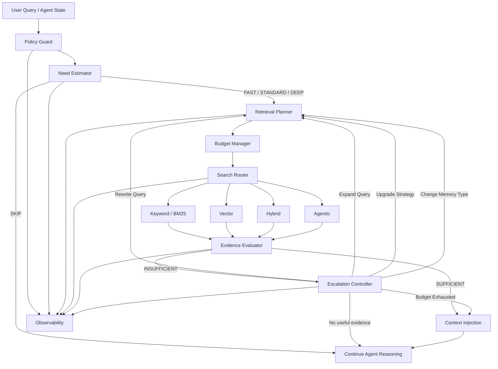
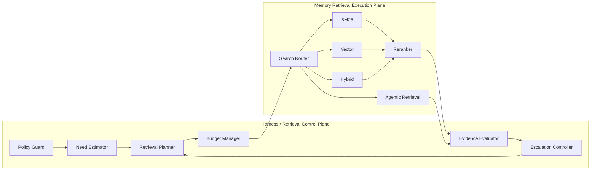
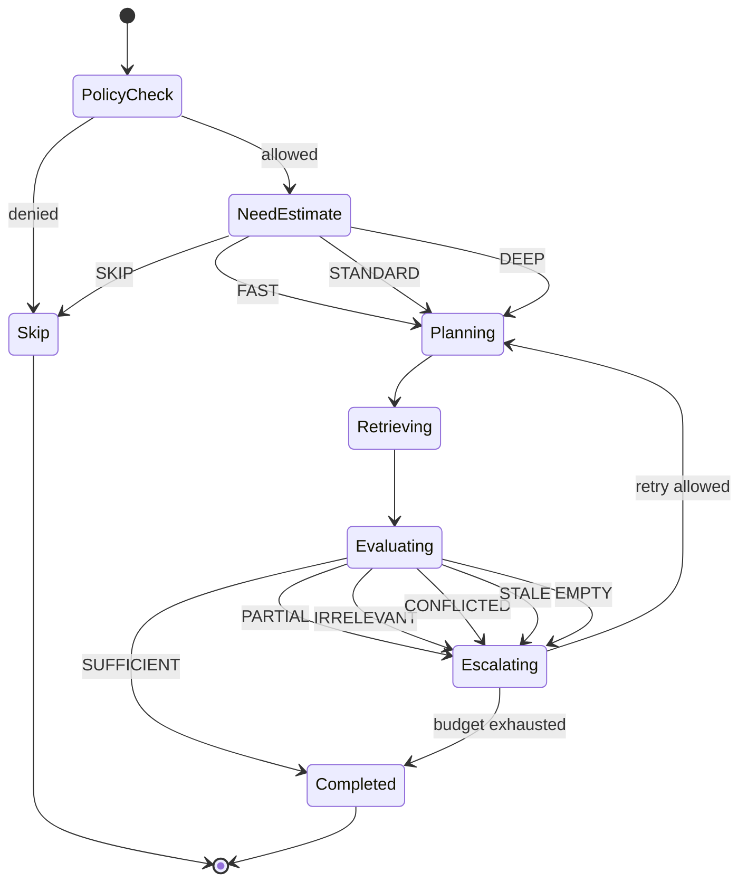
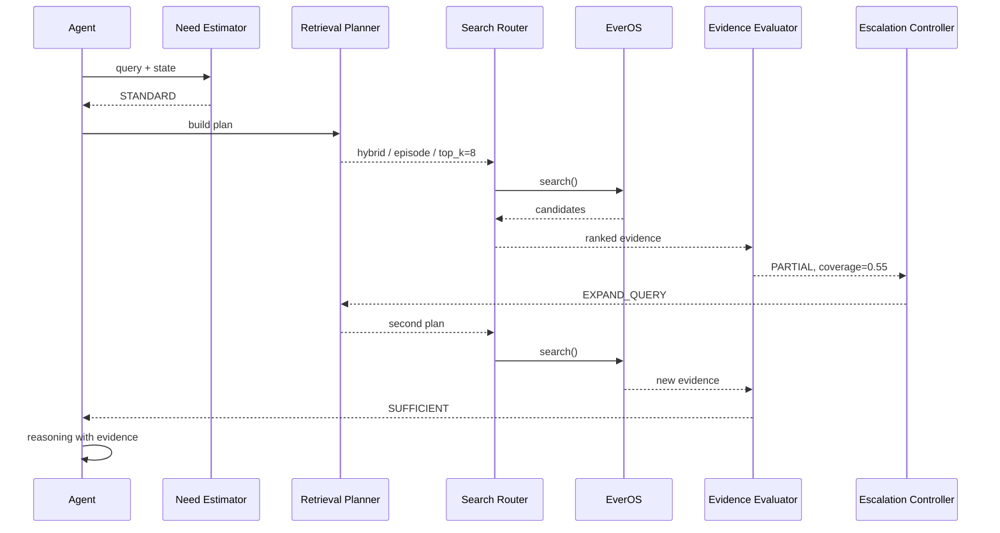
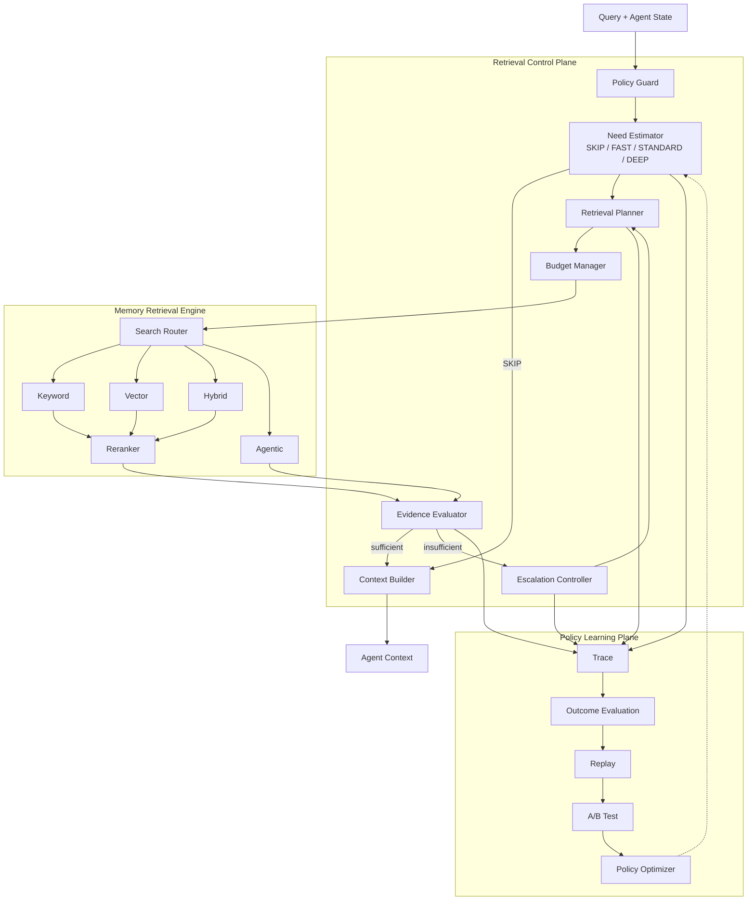

# Retrieve Policy Controller 详细设计方案

> 版本：v1.0  
> 日期：2026-09-02  
> 定位：Agent Harness / Memory Retrieval Control Plane  
> 目标：将原有单一 `RetrieveGate(bool)` 升级为可解释、可评测、可回放、可演进的 **Retrieve Policy Controller（检索策略控制器）**

---

## 0. 文档摘要

当前 Retrieve Gate 如果只回答：

```text
是否检索？
YES / NO
```

它会很快遇到以下问题：

1. **规则过于单一**：无法表达“简单查一次”和“复杂多轮查找”的差异。
2. **检索成本不可控**：复杂 Agentic Retrieval 可能被滥用。
3. **检索结果缺少质量闭环**：一次 Retrieve 返回结果后，没有判断“这些结果到底够不够”。
4. **策略与搜索实现耦合**：Gate、Planner、Search Router 容易混成一个组件。
5. **无法持续优化**：只有 bool 输出时，很难通过 trace、A/B Test、离线 replay 学习更优策略。
6. **上下文污染风险**：错误或低质量记忆被直接注入模型，可能比“不检索”更差。

本方案将 Retrieve Gate 重新定义为：

> **一个根据当前任务状态、记忆依赖程度、上下文充分程度、任务复杂度、检索收益与成本，动态决定检索深度，并在检索后继续判断证据是否充分的 Retrieval Control Plane。**

核心链路：

```text
Query / Agent State
        │
        ▼
Policy Guard
        │
        ▼
Need Estimator
        │
 ┌──────┼───────────┐
 │      │           │
SKIP   FAST      STANDARD / DEEP
 │      │           │
 │      └─────┬─────┘
 │            ▼
 │     Retrieval Planner
 │            │
 │            ▼
 │       Search Router
 │            │
 │            ▼
 │    Evidence Evaluator
 │            │
 │      ┌─────┴─────┐
 │      │           │
 │   SUFFICIENT   INSUFFICIENT
 │      │           │
 │      │     Escalation Controller
 │      │           │
 │      │        RETRY / STOP
 │      │
 └──────┴──────────────► Context Injection
                         │
                         ▼
                    Agent Reasoning
```

最终目标不是构造一个越来越复杂的 `if/else`，而是形成：

```text
Retrieval Policy
+
Retrieval Planning
+
Retrieval Execution
+
Evidence Evaluation
+
Adaptive Escalation
+
Budget Control
+
Observability & Learning
```

---

# 1. 背景

我们当前 Memory Engine 已经逐渐形成如下能力：

- SQLite / LanceDB
- Embedding
- Vector Search
- FTS / BM25
- Fusion
- Hybrid Search
- Reranker
- Memory Type
- EverOS Memory
- Episode / Profile / Agent Case / Agent Skill
- Retrieval Routing

随着能力增加，一个关键问题出现：

> **不是“能不能检索”，而是“什么时候值得检索，以及应该投入多少检索成本”。**

如果没有独立的控制层，系统很容易演化成：

```text
所有请求
   ↓
Hybrid Search
   ↓
Rerank
   ↓
Top K
   ↓
塞进 Context
```

甚至：

```text
所有请求
   ↓
Agentic Retrieval
```

这两种方案都存在明显问题。

---

# 2. 第一性原理

## 2.1 Retrieval 的目的不是“找到 Memory”

Retrieval 真正的目标是：

> **提高 Agent 最终决策或生成结果的质量。**

因此检索本身不是目的。

定义一次检索的期望效用：

\[
U(R) =
G_{quality}
-
C_{latency}
-
C_{token}
-
C_{compute}
-
R_{noise}
-
R_{negative\ transfer}
\]

其中：

- `G_quality`：检索带来的预期质量提升；
- `C_latency`：额外延迟；
- `C_token`：检索、rerank、LLM judge 带来的 token 成本；
- `C_compute`：Embedding / Vector / Rerank / LLM 等资源消耗；
- `R_noise`：无关信息引入 Context 的风险；
- `R_negative transfer`：错误历史经验影响当前决策的风险。

因此 Gate 的本质问题不是：

```text
Do we have memory?
```

也不是：

```text
Can we retrieve?
```

而是：

```text
Will retrieval improve this decision enough
to justify its cost and risk?
```

---

# 3. 设计目标

Retrieve Policy Controller 必须满足以下目标。

## 3.1 功能目标

### G1. 判断是否需要 Retrieval

输出不再是单一 bool，而是检索深度：

```text
SKIP
FAST
STANDARD
DEEP
```

### G2. 区分简单检索和复杂检索

例如：

```text
“我之前喜欢哪种 IDE？”
```

可能只需要：

```text
FAST
→ Profile / Episode
→ top_k = 3
```

而：

```text
“结合我们过去三个月关于 Harness、
EverOS 和 RSI 的讨论重新评估架构”
```

更可能需要：

```text
DEEP
→ 多 Memory Type
→ 多 Query
→ Hybrid
→ Reranker
→ Evidence Evaluation
→ 必要时二次检索
```

### G3. 检索后判断证据是否充分

系统不能假设：

```text
retriever 返回结果
=
结果可以使用
```

必须增加：

```text
Evidence Evaluator
```

### G4. 支持渐进升级

优先使用较低成本方案：

```text
FAST
 ↓
STANDARD
 ↓
DEEP
```

而不是默认最高成本。

### G5. 可解释

每一个 Retrieve Decision 都应该能够回答：

```text
为什么检索？
为什么不检索？
为什么使用 DEEP？
为什么进行了第二轮检索？
为什么停止？
```

### G6. 可回放

相同输入和相同策略版本应该能够：

```text
Replay
Compare
Evaluate
Regression Test
```

### G7. 模型可替换

Harness 不应该依赖某一个模型“恰好会正确决定”。

因此：

```text
Policy
!=
Prompt
```

---

# 4. 非目标

本组件不负责：

### 4.1 不负责 Memory 存储

例如：

```text
LanceDB
SQLite
Markdown
EverOS
```

属于 Memory Engine。

### 4.2 不负责底层 Retrieval Algorithm

例如：

```text
BM25
Vector ANN
RRF
Cross Encoder
```

属于 Search Engine / Search Router。

### 4.3 不负责 Memory Extraction

例如：

```text
Conversation → Episode
Episode → AtomicFact
Episode → Foresight
```

属于 Memory Write Pipeline。

### 4.4 不负责最终回答

Retrieve Policy Controller 只产生：

```text
retrieval decisions
+
evidence package
```

最终 reasoning 仍属于 Agent。

---

# 5. 成熟案例分析

---

## 5.1 Adaptive-RAG

论文：

> Adaptive-RAG: Learning to Adapt Retrieval-Augmented Large Language Models through Question Complexity

核心思想：

```text
Query
  ↓
Complexity Classifier
  ├── No Retrieval
  ├── Single-Step Retrieval
  └── Iterative Retrieval
```

它解决的核心问题是：

> 不同 Query 的复杂度不同，不应该使用固定 Retrieval Strategy。

对本系统的启发：

```text
bool Gate
   ↓
Multi-Level Retrieval Policy
```

我们进一步扩展为：

```text
SKIP
FAST
STANDARD
DEEP
```

而不是只有：

```text
No RAG
Single RAG
Iterative RAG
```

原因是 Agent Memory 的搜索策略比通用 QA 更丰富。

---

## 5.2 LangGraph Agentic RAG

LangGraph 官方 Agentic RAG 的重要结构：

```text
Generate Query or Respond
        │
        ├── Direct Answer
        │
        └── Retrieve
               │
               ▼
        Grade Documents
          │         │
        good       bad
          │         │
        Answer   Rewrite
                    │
                    └────► Retrieve
```

它证明了两个重要事实：

### 第一

Retrieve 前需要 Gate：

```text
Should Retrieve?
```

### 第二

Retrieve 后仍然需要 Gate：

```text
Is Evidence Good Enough?
```

这构成：

```text
Pre-Retrieval Gate
+
Post-Retrieval Gate
```

---

## 5.3 CRAG

CRAG：

> Corrective Retrieval Augmented Generation

核心创新之一是：

```text
Retrieval Evaluator
```

检索结果不是直接使用，而是：

```text
Evidence
   ↓
Evaluator
   ↓
Correct / Ambiguous / Incorrect
```

然后触发不同策略。

本系统吸收该思想，但将判断扩展为：

```text
relevance
coverage
freshness
consistency
authority
redundancy
```

---

## 5.4 Self-RAG

Self-RAG 让模型学习：

```text
什么时候 Retrieval
检索结果是否 relevant
生成结果是否有 evidence support
```

其核心思想值得借鉴：

```text
Retrieval
不是固定步骤
而是 reasoning action
```

但本项目不直接采用 Self-RAG 的模型内化设计。

原因：

```text
Self-RAG
    ↓
Policy largely inside model

我们的 Harness
    ↓
Policy outside model
```

这样能够保持：

- 可解释；
- 可测试；
- 可替换模型；
- 可做 deterministic replay；
- 可进行版本管理；
- 可做策略 A/B Test。

---

## 5.5 LlamaIndex RouterRetriever

LlamaIndex `RouterRetriever` 的职责是：

> 根据 query 和 retriever metadata，从多个 retriever 中选择一个或多个。

对应到我们的架构：

```text
Retrieval Planner
       ↓
Search Router
```

而不是 Retrieve Gate。

这说明：

> **Need Decision 与 Search Strategy Selection 应该是两个组件。**

---

## 5.6 GraphRAG DRIFT

DRIFT：

> Dynamic Reasoning and Inference with Flexible Traversal

其关键不是单次检索，而是：

```text
Initial Search
   ↓
Intermediate Answer
   ↓
Follow-up Question
   ↓
Local Search
   ↓
Confidence
   ↓
Continue / Stop
```

重要启发：

### Retrieval Loop 必须有

```text
Budget
+
Confidence
+
Stop Condition
```

否则 Agentic Retrieval 很容易无限扩张。

---

## 5.7 EverOS

当前 EverOS Search API 提供：

```text
keyword
vector
hybrid
agentic
```

其中：

```text
keyword
→ BM25

vector
→ Dense Vector

hybrid
→ BM25 + Vector + Fusion

agentic
→ iterative retrieval + rerank
```

EverOS 更适合作为：

```text
Retrieval Execution Plane
```

而不是：

```text
Retrieval Policy Plane
```

因此我们的 Harness 必须保留对：

```text
是否检索
检索深度
Memory Type
Query
Budget
Escalation
```

的控制。

---

# 6. 总体架构



---

# 7. Control Plane 与 Execution Plane

整体架构必须明确区分两层。

## 7.1 Control Plane

Harness 负责：

```text
Policy Guard
Need Estimator
Retrieval Planner
Budget Manager
Evidence Evaluator
Escalation Controller
Context Builder
```

---

## 7.2 Execution Plane

EverOS / Memory Engine 负责：

```text
Keyword Search
Vector Search
Hybrid Search
Rerank
Agentic Retrieval
Memory Storage
Index
```

---

## 7.3 边界



---

# 8. 核心组件

---

# 8.1 Policy Guard

## 职责

只处理：

```text
Hard Constraint
```

例如：

- 当前 Agent 是否允许访问 Memory；
- 是否允许访问该 user；
- project scope 是否匹配；
- memory 是否被显式关闭；
- memory type 是否允许访问；
- privacy / tenant boundary；
- tool permission；
- 当前运行模式是否允许 retrieval。

## 原则

Policy Guard：

```text
MUST be deterministic
```

不要依赖 LLM。

示例：

```python
class PolicyGuardResult:
    allowed: bool
    allowed_memory_types: set[str]
    denied_memory_types: set[str]
    reason_codes: list[str]
```

---

# 8.2 Need Estimator

Need Estimator 是原 RetrieveGate 的真正升级版。

回答：

> 当前任务值得投入多少 Retrieval 成本？

---

## 8.2.1 输出

```python
from enum import Enum


class RetrievalAction(str, Enum):
    SKIP = "skip"
    FAST = "fast"
    STANDARD = "standard"
    DEEP = "deep"
```

---

## 8.2.2 判断信号

### A. Memory Dependency

问题是否依赖历史信息。

例如：

```text
“我们之前决定……”
“上次那个方案……”
“按照我的习惯……”
“继续昨天的设计……”
```

高 Memory Dependency。

---

### B. Context Sufficiency

虽然 Query 依赖历史，但当前 context 已经包含信息，则可能不需要 retrieval。

例如：

```text
Memory Dependency = HIGH
Context Sufficiency = HIGH
```

最终可以：

```text
SKIP
```

这是非常关键的一点。

不要把：

```text
涉及过去
=
一定查 Memory
```

---

### C. User / Project Specificity

问题是否依赖：

```text
用户特定信息
项目私有信息
Agent 运行历史
```

---

### D. Temporal Dependency

例如：

```text
之前
上次
最近一次
过去三个月
之前方案
历史决策
```

---

### E. Task Complexity

需要判断：

```text
single fact
multi constraint
multi-hop
comparison
historical synthesis
cross-memory reasoning
```

---

### F. Model Uncertainty

Agent 当前对于事实是否缺乏信心。

注意：

```text
Uncertainty
!=
必须 Retrieval
```

因为不确定的问题可能需要：

```text
Web Search
Tool
Database
```

而不是 Memory。

---

### G. Retrieval Expected Gain

预测：

```text
Memory 是否真的可能包含有用信息
```

---

# 8.3 Need Score

初期可以采用可解释 scoring。

例如：

\[
S =
w_mM +
w_c(1-C) +
w_tT +
w_pP +
w_qQ +
w_uU
\]

其中：

- `M`：memory dependency；
- `C`：context sufficiency；
- `T`：temporal dependency；
- `P`：project/user specificity；
- `Q`：task complexity；
- `U`：uncertainty。

---

## 推荐初始权重

```yaml
retrieve_gate:
  weights:
    memory_dependency: 0.30
    context_insufficiency: 0.25
    temporal_dependency: 0.10
    specificity: 0.15
    complexity: 0.10
    uncertainty: 0.10
```

不要将这些数字视为永久参数。

它们只是：

```text
Bootstrap Policy
```

最终应该通过 trace 数据优化。

---

# 9. Retrieval Level

---

## 9.1 SKIP

适用：

```text
无需历史信息
或
当前 Context 已足够
```

例如：

```text
“Python 的 list comprehension 是什么？”
```

---

## 9.2 FAST

目标：

```text
低成本找一个明确事实
```

推荐策略：

```text
Memory Type: 1
Query Count: 1
Search: keyword / vector
Top K: 3~5
Rerank: optional
LLM Judge: no
```

典型请求：

```text
“我之前说最常用哪个 IDE？”
```

---

## 9.3 STANDARD

目标：

```text
常规 Memory Recall
```

推荐：

```text
Memory Type: 1~2
Query Count: 1~2
Search: hybrid
Top K: 5~10
Rerank: yes
Evidence Evaluation: yes
```

---

## 9.4 DEEP

目标：

```text
复杂历史推理 / 多 Memory 交叉分析
```

推荐：

```text
Multiple Memory Types
Multi Query
Hybrid
Rerank
Evidence Evaluation
Query Rewrite
Iterative Retrieval
Agentic Search
```

例如：

```text
“结合之前关于 Cordis、EverOS、
Harness 和 RSI 的讨论重新设计整个系统。”
```

---

# 10. Retrieval Planner

Need Estimator 只决定：

```text
How much retrieval?
```

Planner 决定：

```text
What retrieval?
```

---

## 10.1 输入

```python
class RetrievalPlanningContext:
    query: str
    agent_state: dict
    gate_decision: "GateDecision"
    allowed_memory_types: list[str]
    previous_attempts: list["RetrievalAttempt"]
```

---

## 10.2 输出

```python
class RetrievalPlan:
    memory_types: list[str]

    queries: list[str]

    method: str

    top_k: int

    filters: dict

    rerank: bool

    min_score: float | None

    budget: "RetrievalBudget"
```

---

# 11. Memory Type Routing

结合 EverOS，可以形成：

```text
User Memory
├── Episode
├── Profile
└── Foresight

Agent Memory
├── Agent Case
└── Agent Skill
```

Planner 必须根据 Query 决定 Memory Type。

---

## 11.1 Profile

适合：

```text
稳定用户偏好
长期属性
工作习惯
技术偏好
```

---

## 11.2 Episode

适合：

```text
某次讨论
某个历史事件
某次决策
某次方案
```

---

## 11.3 Foresight

适合：

```text
过去推导出的未来行动
潜在风险
后续决策方向
```

---

## 11.4 Agent Case

适合：

```text
之前如何完成类似任务
成功执行案例
失败案例
```

---

## 11.5 Agent Skill

适合：

```text
已经沉淀出来的稳定 procedure
workflow
tool usage pattern
```

---

# 12. Search Router

SearchRouter 只负责：

> 给定 RetrievalPlan，选择具体 Retrieval Algorithm。

推荐映射：

```text
FAST
├── keyword
└── vector

STANDARD
└── hybrid + rerank

DEEP
├── hybrid
├── multi-query
├── rerank
└── agentic
```

---

# 13. Evidence Evaluator

这是本方案中最关键的新组件之一。

它回答：

> 当前找到的证据，是否足以支持 Agent 接下来的 reasoning？

---

## 13.1 为什么不能只看 similarity score

因为：

```text
Similarity
!=
Answerability
```

例如：

用户问：

```text
“我们之前最终决定选择 Python 还是 Rust？”
```

Retriever 找到大量包含：

```text
Python
Rust
Agent
```

的历史内容。

Similarity 很高。

但如果这些内容只是：

```text
讨论阶段
```

而没有：

```text
最终决定
```

那么：

```text
relevance = high
coverage = low
```

不能停止。

---

# 14. Evidence Dimensions

建议最少评价六个维度。

---

## 14.1 Relevance

证据是否与当前问题相关。

---

## 14.2 Coverage

是否覆盖问题需要的信息。

---

## 14.3 Freshness

对于有时间要求的信息：

```text
是不是最新版本
```

---

## 14.4 Consistency

多个 Memory 是否互相冲突。

---

## 14.5 Authority

不同 Memory 类型可信度不同。

例如：

```text
Explicit User Decision
>
Inferred Preference
>
Foresight
```

---

## 14.6 Redundancy

Top K 结果是否只是同一件事情的重复。

---

# 15. EvidenceAssessment

```python
class EvidenceAssessment:
    relevance: float

    coverage: float

    freshness: float

    consistency: float

    authority: float

    redundancy: float

    confidence: float

    sufficient: bool

    missing_aspects: list[str]

    conflicts: list[str]

    suggested_action: str
```

---

# 16. Evidence 状态

建议不要只使用：

```text
GOOD / BAD
```

而使用：

```text
SUFFICIENT
PARTIAL
CONFLICTED
STALE
IRRELEVANT
EMPTY
```

例如：

```python
class EvidenceStatus(str, Enum):
    SUFFICIENT = "sufficient"
    PARTIAL = "partial"
    CONFLICTED = "conflicted"
    STALE = "stale"
    IRRELEVANT = "irrelevant"
    EMPTY = "empty"
```

---

# 17. Escalation Controller

当：

```text
Evidence != SUFFICIENT
```

并不代表立即继续检索。

Escalation Controller 需要决定：

```text
下一步做什么？
```

---

## 17.1 Action

```python
class EscalationAction(str, Enum):
    STOP = "stop"

    RETRY = "retry"

    REWRITE_QUERY = "rewrite_query"

    EXPAND_QUERY = "expand_query"

    CHANGE_MEMORY_TYPE = "change_memory_type"

    UPGRADE_METHOD = "upgrade_method"

    INCREASE_TOP_K = "increase_top_k"

    AGENTIC = "agentic"
```

---

# 18. Progressive Retrieval

推荐默认采用：

```text
Least Expensive First
```

例如：

```text
FAST
 │
 ▼
keyword/vector
 │
 ▼
Evidence sufficient?
 │
 ├── yes → STOP
 │
 └── no
      │
      ▼
STANDARD
 │
 ▼
hybrid + rerank
 │
 ▼
Evidence sufficient?
 │
 ├── yes → STOP
 │
 └── no
      │
      ▼
DEEP
 │
 ▼
multi-query / agentic
```

这可以理解为：

> **Progressive Disclosure for Retrieval**

---

# 19. Budget Manager

Agentic Retrieval 最大风险之一是：

```text
无限检索
```

必须设置明确 Budget。

---

## 19.1 Budget Model

```python
class RetrievalBudget:
    max_rounds: int

    max_queries: int

    max_top_k_total: int

    max_latency_ms: int

    max_llm_calls: int

    max_rerank_calls: int

    max_context_tokens: int
```

---

## 19.2 推荐默认值

```yaml
retrieval_budget:

  fast:
    max_rounds: 1
    max_queries: 1
    max_latency_ms: 150
    max_llm_calls: 0
    max_context_tokens: 800

  standard:
    max_rounds: 2
    max_queries: 2
    max_latency_ms: 600
    max_llm_calls: 1
    max_context_tokens: 2000

  deep:
    max_rounds: 4
    max_queries: 6
    max_latency_ms: 2500
    max_llm_calls: 4
    max_context_tokens: 5000
```

这些数值必须后续通过 benchmark 调整。

---

# 20. Stop Condition

必须至少包含：

```text
Evidence Sufficient
OR
Budget Exhausted
OR
Marginal Gain Too Low
OR
Repeated Query
OR
No New Evidence
```

---

## 20.1 Marginal Gain

例如：

第一轮：

```text
coverage = 0.40
```

第二轮：

```text
coverage = 0.75
```

提升：

```text
+0.35
```

值得继续。

第三轮：

```text
coverage = 0.77
```

只提升：

```text
+0.02
```

则可以停止。

定义：

\[
\Delta G =
EvidenceScore_t -
EvidenceScore_{t-1}
\]

如果：

```text
ΔG < min_gain
```

连续发生，则停止。

---

# 21. Query Rewrite

Query Rewrite 不应该默认发生。

只有：

```text
Evidence = IRRELEVANT
或
Evidence = PARTIAL
```

且当前 Query 可能表达不足时才触发。

例如：

原 Query：

```text
“之前那个 Gate”
```

Rewrite：

```text
“Retrieve Gate / Retrieve Router /
Memory Retrieval Policy Controller
previous architecture decision”
```

---

# 22. Query Expansion

Rewrite：

```text
换一种表达
```

Expansion：

```text
拆成多个子问题
```

例如：

```text
“之前的 Harness 方案”
```

可以拆成：

```text
Harness architecture
Retrieve Gate
Context management
Validation
Memory routing
```

---

# 23. Retrieval State Machine



---

# 24. End-to-End Sequence



---

# 25. Gate Decision Schema

建议核心数据结构：

```python
from dataclasses import dataclass, field


@dataclass
class GateSignals:

    memory_dependency: float

    context_sufficiency: float

    temporal_dependency: float

    specificity: float

    complexity: float

    uncertainty: float


@dataclass
class GateDecision:

    action: RetrievalAction

    confidence: float

    signals: GateSignals

    reason_codes: list[str] = field(default_factory=list)

    suggested_memory_types: list[str] = field(default_factory=list)

    escalation_allowed: bool = True

    policy_version: str = "retrieve-policy-v1"
```

---

# 26. Reason Code

不要只记录自然语言。

建议标准化：

```text
MEMORY_REFERENCE_EXPLICIT
HISTORICAL_CONTEXT_REQUIRED
CURRENT_CONTEXT_INSUFFICIENT
USER_SPECIFIC_INFO
PROJECT_SPECIFIC_INFO
MULTI_HOP_TASK
HIGH_UNCERTAINTY
CONTEXT_ALREADY_SUFFICIENT
NO_MEMORY_DEPENDENCY
POLICY_DENIED
```

这对：

```text
Metric
Debug
Replay
Training Data
```

都非常重要。

---

# 27. Rule Engine

V1 推荐：

```text
Rule
+
Score
```

例如：

```python
if explicit_memory_reference:
    score += 0.35

if project_specific:
    score += 0.20

if context_sufficiency > 0.8:
    score -= 0.40

if multi_hop:
    score += 0.15
```

输出：

```python
if score < 0.25:
    SKIP

elif score < 0.50:
    FAST

elif score < 0.75:
    STANDARD

else:
    DEEP
```

---

# 28. 为什么 V1 不应该直接使用 LLM Gate

如果：

```text
Query
 ↓
LLM
 ↓
retrieve?
```

存在：

```text
模型版本变化
Prompt 漂移
温度波动
Provider 差异
难回归
难解释
成本
延迟
```

因此推荐：

```text
Rules
  ↓
Confidence
  ↓
Ambiguous?
  ├── no → decision
  └── yes
        ↓
     Small Model / LLM Judge
```

---

# 29. Hybrid Gate

推荐最终形成：

```text
Deterministic Feature Extraction
          │
          ▼
      Rule Engine
          │
          ▼
    Confidence Check
     │            │
    high          low
     │            │
 decision      classifier
                  │
                  ▼
              decision
```

LLM 只处理：

```text
Ambiguous Case
```

---

# 30. Context Sufficiency Detector

这个组件非常重要。

否则系统容易重复 Retrieve 已经存在于 Context 的内容。

输入：

```text
Query
+
Current Context
```

输出：

```python
ContextAssessment(
    sufficient=True,
    confidence=0.88,
    missing_information=[]
)
```

可以先使用：

```text
heuristic
+
embedding similarity
+
structured state
```

不建议一开始全部 LLM 判断。

---

# 31. Context Injection

Retriever 找到的内容不能原样全部塞入 Prompt。

Context Builder 应执行：

```text
deduplicate
compress
rank
group by memory type
preserve provenance
token budget
```

---

## 推荐格式

```text
[Memory Evidence]

# Profile
- ...

# Relevant Episodes
1. ...
2. ...

# Previous Decisions
- ...

# Agent Cases
- ...

[Retrieval Metadata]
confidence: 0.87
coverage: 0.91
```

---

# 32. Provenance

每条 Memory 必须保留：

```text
memory_id
memory_type
source
created_at
updated_at
score
retrieval_method
rerank_score
```

否则模型输出错误时无法定位：

```text
是生成错了
还是 Memory 错了
还是 Retrieval 错了
```

---

# 33. Conflict Handling

Memory 系统一定会出现冲突。

例如：

```text
2026-01
用户选择 TypeScript

2026-08
用户决定新模块改 Python
```

Evidence Evaluator 必须能发现：

```text
conflict
```

但不要简单删除旧 Memory。

应该：

```text
detect
→ rank by temporal / authority
→ expose conflict
→ planner decides
```

---

# 34. Freshness

对于：

```text
Preference
Architecture Decision
Project State
```

最新信息往往更重要。

可以引入：

\[
Score_{final}
=
Score_{semantic}
\times
Decay(time)
\]

但：

```text
Episode
```

不能统一使用强时间衰减。

因为用户可能明确问：

```text
“去年那次讨论”
```

所以 freshness 必须：

```text
Query-aware
```

---

# 35. Cache

Gate 和 Retrieval 可以分别缓存。

---

## Gate Cache

Key：

```text
normalized_query
+
agent_state_signature
+
policy_version
```

---

## Retrieval Cache

Key：

```text
query
+
memory_version
+
method
+
filters
```

Memory 写入后：

```text
memory_version++
```

即可实现 cache invalidation。

---

# 36. Observability

每次 retrieval 必须产生完整 trace。

建议：

```json
{
  "trace_id": "...",
  "policy_version": "v1",
  "query": "...",

  "gate": {
    "action": "STANDARD",
    "confidence": 0.83,
    "reason_codes": [
      "HISTORICAL_CONTEXT_REQUIRED"
    ]
  },

  "plan": {
    "memory_types": ["episode"],
    "method": "hybrid",
    "top_k": 8
  },

  "attempts": [
    {
      "round": 1,
      "latency_ms": 125,
      "results": 8
    }
  ],

  "evidence": {
    "relevance": 0.91,
    "coverage": 0.76,
    "status": "PARTIAL"
  },

  "final": {
    "rounds": 2,
    "latency_ms": 381,
    "tokens": 1580
  }
}
```

---

# 37. 核心 Metrics

---

## 37.1 Retrieval Trigger Rate

\[
RTR =
\frac{retrieval\ requests}{all\ requests}
\]

观察 Gate 是否：

```text
过度 Retrieval
```

---

## 37.2 Retrieval Precision

Retrieve 的请求中：

```text
真正帮助回答的比例
```

---

## 37.3 Retrieval Recall

应该 Retrieve 的请求中：

```text
实际触发 Retrieval 的比例
```

---

## 37.4 Evidence Utility

可以通过：

```text
With Retrieval
vs
Without Retrieval
```

比较：

```text
answer quality
task success
```

---

## 37.5 Escalation Rate

```text
FAST → STANDARD
STANDARD → DEEP
```

发生比例。

---

## 37.6 Retrieval Waste Rate

定义：

```text
触发 Retrieval
但最终 evidence 未被使用
```

这是非常重要的成本指标。

---

## 37.7 Context Pollution Rate

检索结果导致回答变差的比例。

这是普通 RAG Benchmark 经常忽视，但 Agent Memory 必须测的指标。

---

# 38. Golden Dataset

建立：

```text
retrieval_policy_dataset.jsonl
```

例如：

```json
{
  "query": "Python 的装饰器是什么？",
  "expected_action": "SKIP"
}
```

```json
{
  "query": "我们之前最终决定 Retrieval Gate 怎么实现？",
  "expected_action": "STANDARD"
}
```

```json
{
  "query": "结合过去关于 EverOS、Cordis 和 RSI 的讨论重新设计架构",
  "expected_action": "DEEP"
}
```

---

# 39. Trace Replay

每次 Policy 更新后：

```text
Historical Trace
      ↓
New Policy
      ↓
Replay
      ↓
Compare
```

关注：

```text
decision change
latency change
cost change
quality change
```

这是 Harness Engineering 非常关键的一层。

---

# 40. A/B Test

可以：

```text
Policy A
Rules v1

vs

Policy B
Rules + classifier
```

指标：

```text
Task Success Rate
Retrieval Trigger Rate
Average Latency
Token Cost
Human Rework Rate
Context Pollution
```

不要只测试：

```text
Retrieval Accuracy
```

最终 KPI 必须是：

```text
Agent Outcome
```

---

# 41. Policy Versioning

必须：

```text
retrieve-policy-v1
retrieve-policy-v2
retrieve-policy-v3
```

Trace 中永久记录：

```text
policy_version
```

否则后续无法回放。

---

# 42. Configuration

推荐：

```yaml
retrieve_policy:

  version: "v1"

  thresholds:
    fast: 0.25
    standard: 0.50
    deep: 0.75

  weights:
    memory_dependency: 0.30
    context_insufficiency: 0.25
    temporal_dependency: 0.10
    specificity: 0.15
    complexity: 0.10
    uncertainty: 0.10

  evidence:
    relevance_threshold: 0.70
    coverage_threshold: 0.70
    consistency_threshold: 0.70

  escalation:
    enabled: true
    max_rounds: 4
    min_marginal_gain: 0.05

  budgets:

    fast:
      max_queries: 1
      max_latency_ms: 150
      max_context_tokens: 800

    standard:
      max_queries: 2
      max_latency_ms: 600
      max_context_tokens: 2000

    deep:
      max_queries: 6
      max_latency_ms: 2500
      max_context_tokens: 5000
```

---

# 43. 推荐代码结构

```text
retrieval/
│
├── policy/
│   ├── models.py
│   ├── guard.py
│   ├── features.py
│   ├── rules.py
│   ├── estimator.py
│   └── config.py
│
├── planner/
│   ├── models.py
│   ├── planner.py
│   ├── query_rewrite.py
│   └── memory_router.py
│
├── execution/
│   ├── router.py
│   ├── everos_adapter.py
│   └── models.py
│
├── evaluation/
│   ├── evidence.py
│   ├── relevance.py
│   ├── coverage.py
│   └── conflicts.py
│
├── escalation/
│   ├── controller.py
│   ├── budget.py
│   └── stop_condition.py
│
├── context/
│   ├── builder.py
│   ├── compressor.py
│   └── deduplicator.py
│
├── observability/
│   ├── trace.py
│   ├── metrics.py
│   └── replay.py
│
└── service.py
```

---

# 44. RetrievalService

上层 Agent 只依赖一个入口：

```python
class RetrievalService:

    async def retrieve(
        self,
        query: str,
        state: AgentState,
    ) -> RetrievalResult:
        ...
```

Agent 不应该直接：

```python
everos.search(...)
```

否则控制面会被绕过。

---

# 45. RetrievalResult

```python
@dataclass
class RetrievalResult:

    decision: GateDecision

    evidence: list[MemoryEvidence]

    assessment: EvidenceAssessment | None

    attempts: list[RetrievalAttempt]

    budget_usage: RetrievalBudgetUsage

    context: str | None

    trace_id: str
```

---

# 46. 主流程伪代码

```python
async def retrieve(query, state):

    guard = policy_guard.check(state)

    if not guard.allowed:
        return RetrievalResult.skip("POLICY_DENIED")

    decision = need_estimator.estimate(
        query=query,
        state=state,
    )

    if decision.action == RetrievalAction.SKIP:
        return RetrievalResult.skip(
            reason=decision.reason_codes
        )

    budget = budget_manager.create(
        decision.action
    )

    attempts = []

    while budget.can_continue():

        plan = planner.plan(
            query=query,
            state=state,
            decision=decision,
            attempts=attempts,
        )

        evidence = await search_router.search(plan)

        assessment = evidence_evaluator.evaluate(
            query=query,
            evidence=evidence,
        )

        attempts.append(
            RetrievalAttempt(
                plan=plan,
                evidence=evidence,
                assessment=assessment,
            )
        )

        if assessment.sufficient:
            break

        action = escalation_controller.next(
            assessment=assessment,
            attempts=attempts,
            budget=budget,
        )

        if action == EscalationAction.STOP:
            break

        planner.apply(action)

    context = context_builder.build(
        attempts=attempts,
        token_budget=budget.context_tokens,
    )

    return RetrievalResult(
        decision=decision,
        evidence=evidence,
        assessment=assessment,
        attempts=attempts,
        context=context,
    )
```

---

# 47. Failure Mode

---

## 47.1 Gate False Negative

应该检索：

```text
却 SKIP
```

结果：

```text
Agent 忘记历史
```

解决：

```text
提高 Retrieval Recall
```

---

## 47.2 Gate False Positive

不需要检索：

```text
却 Retrieve
```

结果：

```text
增加 latency
增加 token
污染 context
```

---

## 47.3 Retrieval False Positive

Retriever 找到：

```text
看起来相关
实际上无关
```

解决：

```text
Evidence Evaluator
```

---

## 47.4 Endless Retrieval

解决：

```text
Budget
Stop Condition
Marginal Gain
```

---

## 47.5 Query Drift

多轮 Rewrite 后逐渐偏离原 Query。

解决：

每轮保留：

```text
Original Intent
```

并计算：

```text
rewritten query
vs
original intent
```

偏离度。

---

## 47.6 Memory Poisoning

错误历史信息可能被反复检索。

因此未来必须支持：

```text
memory confidence
source authority
validation state
```

Evidence Evaluator 使用这些 metadata。

---

# 48. 迭代路线

---

## V1 — Deterministic Policy

组成：

```text
Policy Guard
Rule-based Need Estimator
SKIP / FAST / STANDARD / DEEP
Budget
Trace
```

核心目标：

```text
先让系统可解释
```

---

## V2 — Evidence Closed Loop

增加：

```text
Evidence Evaluator
Escalation Controller
Query Rewrite
```

形成：

```text
Retrieve
→ Evaluate
→ Retry
```

---

## V3 — Hybrid Decision

增加：

```text
Small Classifier
+
LLM Ambiguous Judge
```

只将：

```text
模糊案例
```

交给模型。

---

## V4 — Learned Retrieval Policy

利用历史 trace：

```text
Query
Gate Decision
Retrieval Result
Final Outcome
```

训练：

\[
P(\text{retrieval improves outcome} \mid state)
\]

Need Estimator 不再主要依赖人工权重。

---

## V5 — Adaptive Policy Optimization

进一步可以使用：

```text
Contextual Bandit
```

Action：

```text
SKIP
FAST
STANDARD
DEEP
```

Reward：

```text
TaskSuccess
-
LatencyPenalty
-
TokenPenalty
-
ContextPollutionPenalty
```

形成真正动态 Retrieval Policy。

---

# 49. 与 RSI 的关系

当系统具有：

```text
Trace
Outcome
Replay
Policy Version
A/B Test
```

之后，就拥有了非常关键的一类自我改进闭环：

```text
Agent Run
   ↓
Retrieval Trace
   ↓
Outcome Evaluation
   ↓
Policy Dataset
   ↓
Policy Optimization
   ↓
New Policy
   ↓
Replay / A-B Test
```

这不是模型参数级 RSI。

而是：

> **Harness Policy Level Self-Improvement**

这与整个自演化 Agent 架构非常契合。

---

# 50. 最终推荐架构



---

# 51. 最终职责边界

| Component | 回答的问题 |
|---|---|
| Policy Guard | 是否允许检索？ |
| Need Estimator | 是否值得检索？投入多大成本？ |
| Retrieval Planner | 应该检索什么？ |
| Search Router | 应该用什么算法检索？ |
| Retriever | 找到了什么？ |
| Evidence Evaluator | 找到的东西够不够？ |
| Escalation Controller | 不够时下一步怎么办？ |
| Budget Manager | 最多允许花多少成本？ |
| Context Builder | 什么内容最终进入 Context？ |
| Observability | 为什么做出这些决定？ |
| Policy Learning | 如何让下一版策略更好？ |

这一职责边界建议作为后续实现时的硬约束。

---

# 52. 核心设计原则

整个 Retrieve 系统最终应遵守以下原则。

## Principle 1

```text
Retrieval is optional.
```

不是每个请求都需要 Memory。

## Principle 2

```text
Retrieval depth must be adaptive.
```

不是所有请求都使用同一策略。

## Principle 3

```text
Retrieved != Useful.
```

检索出来不代表应该使用。

## Principle 4

```text
Start cheap, escalate only when justified.
```

优先低成本路径。

## Principle 5

```text
Every retrieval loop needs a budget.
```

任何循环都必须可终止。

## Principle 6

```text
Policy must be observable.
```

每个决定都应该可解释。

## Principle 7

```text
Policy must be replayable.
```

Harness 的行为必须可复现。

## Principle 8

```text
Optimize agent outcome, not retrieval score.
```

最终目标不是更高 similarity。

而是：

```text
更高 Task Success
更低 Human Rework
更低 Cost
更低 Latency
```

---

# 53. 推荐最终命名

原：

```text
RetrieveGate
```

建议保留作为内部一个概念，但系统级组件改名：

```text
RetrievePolicyController
```

其内部：

```text
RetrievePolicyController
│
├── PolicyGuard
├── NeedEstimator
├── RetrievalPlanner
├── BudgetManager
├── EvidenceEvaluator
├── EscalationController
└── ContextBuilder
```

因为系统已经不再只是：

```text
Gate
```

而是：

> **整个 Retrieval 生命周期的控制器。**

---

# 54. 结论

Retrieve Gate 的正确演进方向不是：

```text
增加更多 if/else
```

而应该从：

```text
Should Retrieve?
```

升级成：

```text
Is retrieval needed?
        ↓
How much retrieval is justified?
        ↓
What memory should be searched?
        ↓
Which retrieval strategy should be used?
        ↓
Is the evidence sufficient?
        ↓
Should retrieval escalate?
        ↓
When must it stop?
```

最终形成：

```text
Retrieve Policy Controller
+
Retrieval Planner
+
Search Router
+
Evidence Evaluator
+
Escalation Controller
+
Budget Manager
+
Observability
+
Policy Learning
```

其中：

```text
Adaptive-RAG
→ Retrieval Depth

LangGraph Agentic RAG
→ Pre/Post Retrieval State Machine

CRAG
→ Evidence Evaluation

LlamaIndex
→ Retriever Routing

GraphRAG DRIFT
→ Iterative Search + Stop Condition

EverOS
→ Retrieval Execution Plane
```

这套组合可以让 Memory Retrieval 从：

```text
一个 RAG 功能
```

逐步演化成：

> **Agent Harness 中一个独立、可优化、可自我迭代的决策子系统。**

---

# 55. 参考资料

1. Adaptive-RAG: Learning to Adapt Retrieval-Augmented Large Language Models through Question Complexity  
   https://arxiv.org/abs/2403.14403

2. Corrective Retrieval Augmented Generation (CRAG)  
   https://arxiv.org/abs/2401.15884

3. Self-RAG: Learning to Retrieve, Generate, and Critique through Self-Reflection  
   https://arxiv.org/abs/2310.11511

4. LangGraph — Build a custom RAG agent  
   https://docs.langchain.com/oss/python/langgraph/agentic-rag

5. LlamaIndex — RouterRetriever  
   https://docs.llamaindex.ai/en/stable/api_reference/retrievers/router/

6. Microsoft GraphRAG — DRIFT Search  
   https://microsoft.github.io/graphrag/query/drift_search/

7. EverOS — API / SearchMethod  
   https://github.com/EverMind-AI/EverOS/blob/main/docs/api.md

8. EverOS — Project Overview  
   https://github.com/EverMind-AI/EverOS/blob/main/docs/overview.md
