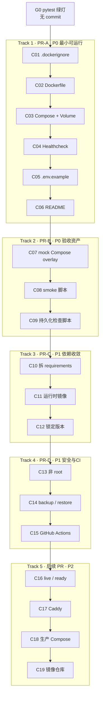

# Agent Memory Engine Docker 部署实施文档

> 蓝本：[AgentMemoryEngine_Docker_Deployment_Implementation_Plan.md](./AgentMemoryEngine_Docker_Deployment_Implementation_Plan.md)  
> 仓库：`SamhandsomeLee/AgentMemoryEngine`  
> 分支：`master`  
> 主线：Stage 10（`app.main:app` + LanceDB `service_memories` + Qwen / mock embedding）  
> 本文定位：**按 commit 落地的施工单**，不是再写一份设计方案。

---

## 0. 文档怎么用

蓝本回答「为什么这样部署」。本文回答「每一次 git commit 具体改什么、怎么验收、禁止夹带什么」。

硬约束：

```text
1 个步骤  =  1 个功能点  =  1 条 commit
```

蓝本附录 F 曾建议打包成 3 个大提交。那是阶段切分，不是本文的施工粒度。

本文把同一条主线拆成可独立 review、可独立回滚的原子 commit。PR 仍按 Track 合并，但 **git history 不允许把多个功能点揉进一次提交**。

```text
蓝本 Implementation Plan
        │
        ▼
本文 Commit 施工单
        │
        ▼
一条条 commit 落到仓库
```

---

## 1. 实施原则

1. **先 P0，后 P1，再 P2。** 前一条 commit 未验收，不开始下一条。
2. **P0 / P1 不改 Stage 10 业务逻辑。** 检索、schema、Harness、Auth 全部禁止夹带。
3. **密钥不进镜像、不进 git。** 禁止 `ENV DASHSCOPE_API_KEY`，禁止 `COPY .env`。
4. **生产入口只有** `uvicorn app.main:app --host 0.0.0.0 --port 8000`。根目录 `main.py` 不是 Docker CMD。
5. **一条 commit 结束时，仓库必须可解释：** 多了什么能力、怎么验证、失败时回滚哪一条。
6. **Windows 与 Linux 用同一套文件。** 脚本用 Python 标准库，避免只写 bash。
7. **不要用 `docker compose down -v` 做日常重启。** `-v` 会删 LanceDB volume。

---

## 2. 当前仓库基线（施工前事实）

以撰写本文时的 `master` 为准：

| 项 | 现状 |
|---|---|
| HTTP 入口 | `app.main:app`，lifespan 会立刻 `get_memory_service()` |
| 健康检查 | `GET /v1/health` → `{"status":"ok","stage":10}`，只证明进程活着 |
| 默认库路径 | `MEMORY_DB_PATH=./database/lance` |
| Stage 10 表 | `service_memories` |
| 默认 embedding | `EMBEDDING_PROVIDER=qwen`，维度 1024 |
| 离线 embedding | `mock` + `EMBEDDING_DIM=32`，必须换目录，不能和 1024 维表混用 |
| 根目录 Docker 文件 | **不存在** `Dockerfile` / `docker-compose.yml` / `.dockerignore` |
| CI | **不存在** `.github/workflows/` |
| `requirements.txt` | 运行时与实验依赖混在一起（含 `sentence-transformers` / `open-clip-torch`） |
| Stage 10 import | HTTP 主链 **不** import torch / OpenCLIP / pypdf |
| 现有 Docker 教程 | `docs/docker/Docker_Agent_Memory_Engine_从第一性原理到实践.md` 是学习文档，**不要改它来充当生产部署** |

P0 构建会很慢、镜像会很大。这是依赖混装造成的，**不在 C01–C09 解决**。

---

## 3. Commit 总账



P3（K8s、多实例抢同一个 LanceDB volume、远程向量库）**不立项**。出现真实需求后再单独开文档。

---

## 4. Git 执行规则

每一条 commit 都按这个循环做，不要攒着一起提交：

```text
改且只改本步骤列出的文件
        ↓
跑本步骤验收命令
        ↓
git status / git diff 确认没有夹带
        ↓
git add <本步骤文件>
        ↓
git commit -m "<本步骤给出的 message>"
        ↓
进入下一步
```

Message 格式与蓝本一致：

```text
feat(deploy): ...
docs(deploy): ...
test(deploy): ...
refactor(deps): ...
chore(deps): ...
ci: ...
feat(api): ...
```

禁止：

- 一条 commit 里同时加 Dockerfile 又改检索代码
- 用 `git add .` 把无关文件带进去
- `--amend` 把下一个功能点补进上一条（除非用户明确要求且符合仓库 commit 规则）
- 在 P0 提交里「顺便」拆依赖、加 Caddy、加 K8s

回滚只回当前这条：

```bash
git revert <sha>
```

不要 `reset --hard` 到更早的 commit，除非用户明确要求。

---

## 5. G0 · 前置门槛（无 commit）

**功能点：** 确认当前源码在容器化之前就是绿的。失败则停止，不把业务 bug 带进 Docker。

```bash
python -m pytest -q
```

至少要过：

```bash
python -m pytest -q \
  tests/test_stage9_api.py \
  tests/test_stage10_api.py \
  tests/test_retrieve_gate.py \
  tests/test_retrieval_planner.py \
  tests/test_search_router.py
```

通过后才能开始 C01。

---

# Track 1 · P0 最小可运行

目标：`docker compose up -d` 之后，宿主机 `8000` 能访问 Stage 10 API，LanceDB 与日志走 named volume。

本 Track 结束时 **还不用** 接真实百炼。那是 C08 之后的手工步骤，不是独立业务 commit。

---

## C01 · 构建上下文隔离

**功能点：** Docker build 不会把密钥、虚拟环境、本地 LanceDB、编辑器文件送进 build context。

**改动文件：**

```text
.dockerignore          （新建）
```

**文件内容：**

```dockerignore
.git

.venv
venv

__pycache__
*.py[cod]

.pytest_cache
.coverage

.env
.env.local
.env.production

database
logs

.idea
.vscode
```

不要写 `.env.*`，否则 `.env.example` 也会被排除。当前 `.gitignore` 已有 `!.env.example`，这里保持同一意图。

**不要改：** `Dockerfile`、业务代码、`docs/docker` 教程。

**验收：**

```bash
# 文件存在即可。下一 commit 才会真正 build。
# 人工确认列表包含 .env / .venv / database / logs
```

**Commit message：**

```text
feat(deploy): exclude secrets and local data from Docker build context
```

---

## C02 · 可构建的 Stage 10 镜像

**功能点：** 仓库能 `docker build` 出镜像，容器内以 `app.main:app` 监听 `0.0.0.0:8000`。

**改动文件：**

```text
Dockerfile             （新建，仓库根目录）
```

**文件内容：**

```dockerfile
FROM python:3.11-slim

ENV PYTHONDONTWRITEBYTECODE=1 \
    PYTHONUNBUFFERED=1 \
    PIP_NO_CACHE_DIR=1

WORKDIR /app

COPY requirements.txt .

RUN python -m pip install --upgrade pip \
    && pip install -r requirements.txt

COPY . .

RUN mkdir -p /data/lance /app/logs

EXPOSE 8000

CMD [
  "python",
  "-m",
  "uvicorn",
  "app.main:app",
  "--host",
  "0.0.0.0",
  "--port",
  "8000"
]
```

**不要做：**

- 改 `CMD` 为 `python main.py`
- `--host 127.0.0.1`
- `--workers 4`
- `COPY .env`
- `USER` 非 root（那是 C13）
- 改用 `requirements-runtime.txt`（那是 C11）

**验收：**

```bash
docker build -t agent-memory-engine:c02 .
```

本步允许镜像很大、构建很慢。失败才阻断。

可选冒烟（不接 compose）：

```bash
docker run --rm -p 8000:8000 ^
  -e EMBEDDING_PROVIDER=mock ^
  -e EMBEDDING_DIM=32 ^
  -e MEMORY_DB_PATH=/tmp/lance ^
  -e AME_LOG_DISABLED=1 ^
  agent-memory-engine:c02
```

另开终端：

```bash
curl http://127.0.0.1:8000/v1/health
```

预期：`{"status":"ok","stage":10}`。验证完停掉容器。

**Commit message：**

```text
feat(deploy): add Dockerfile for Stage 10 FastAPI entrypoint
```

---

## C03 · Compose 编排与数据卷

**功能点：** 一条命令启动服务；LanceDB 与应用日志落到 named volume，代码与数据分离。

**改动文件：**

```text
docker-compose.yml     （新建，仓库根目录）
```

**文件内容：**

```yaml
services:
  agent-memory-engine:
    build:
      context: .
      dockerfile: Dockerfile

    container_name: agent-memory-engine
    restart: unless-stopped

    env_file:
      - .env

    environment:
      MEMORY_DB_PATH: /data/lance
      LOG_DIR: /app/logs

    ports:
      - "8000:8000"

    volumes:
      - ame_lance_data:/data/lance
      - ame_logs:/app/logs

volumes:
  ame_lance_data:
  ame_logs:
```

说明：

- `environment.MEMORY_DB_PATH` 会覆盖 `.env` 里的 `./database/lance`。这是容器内必须的绝对路径。
- 本步 **不加** healthcheck（C04）和 mock overlay（C07）。
- 若本机还没有 `.env`，先 `cp .env.example .env`。C03 不把 `.env` 提交进 git。

**不要做：** 加 Postgres / Redis / Qdrant、`scale`、把 8000 换成 HTTPS。

**验收：**

```bash
docker compose up -d --build
docker compose ps
docker compose logs --tail=80 agent-memory-engine
curl http://127.0.0.1:8000/v1/health
```

`ps` 中容器应为 running。若 `.env` 仍是 `EMBEDDING_PROVIDER=qwen` 且没有密钥，lifespan 可能启动失败——这是源码的既有行为。此时把 `.env` 临时改为 mock 只为验证 C03，**不要把个人 `.env` 提交进去**。更干净的做法是做完 C03 验收后停服务，等 C07 overlay。

```bash
docker compose down
```

不要加 `-v`。

**Commit message：**

```text
feat(deploy): add compose service with LanceDB and log volumes
```

---

## C04 · 容器存活探测

**功能点：** Docker 用 `GET /v1/health` 判断进程是否在服务，而不是只看 PID 还在。

**改动文件：**

```text
docker-compose.yml     （只加 healthcheck）
```

在 `agent-memory-engine` 服务下追加：

```yaml
    healthcheck:
      test:
        [
          "CMD",
          "python",
          "-c",
          "import urllib.request; urllib.request.urlopen('http://127.0.0.1:8000/v1/health', timeout=3)"
        ]
      interval: 30s
      timeout: 5s
      retries: 3
      start_period: 20s
```

slim 镜像没有 curl，必须用镜像内 Python。探测的是 liveness，不是 LanceDB 可写、也不是百炼可达。

**不要做：** 新增 `/v1/health/ready`（C16）、每次 healthcheck 调用 embedding。

**验收：**

```bash
docker compose up -d
docker compose ps
```

`STATUS` 应逐步变为 `healthy`。

```bash
docker compose down
```

**Commit message：**

```text
feat(deploy): add compose liveness check against /v1/health
```

---

## C05 · Docker 环境变量约定

**功能点：** `.env.example` 写清本地路径与容器路径、qwen 与 mock 不得共用库目录，避免后来者把 32 维 mock 写进 1024 维表。

**改动文件：**

```text
.env.example           （只追加注释与 Docker 示例块，不改现有本地默认值）
```

在现有文件末尾追加（保留当前本地默认 `./database/lance` 与 `qwen`，避免破坏非 Docker 开发）：

```dotenv
# --- Docker (docker compose overrides MEMORY_DB_PATH / LOG_DIR) ---
# Compose sets:
#   MEMORY_DB_PATH=/data/lance
#   LOG_DIR=/app/logs
# Do not COPY this file into the image. Fill secrets only in local .env.
#
# Offline / first Docker verification (use docker-compose.mock.yml):
# EMBEDDING_PROVIDER=mock
# EMBEDDING_DIM=32
# MEMORY_DB_PATH=/data/lance_mock
#
# Never point mock (32-dim) and qwen (1024-dim) at the same LanceDB directory.
```

**不要做：** 把默认 `EMBEDDING_PROVIDER` 改成 mock；提交真实 key。

**验收：** `git diff .env.example` 只有注释 / 示例；本地 `python -m uvicorn app.main:app` 行为不变。

**Commit message：**

```text
docs(deploy): document Docker and mock embedding env contract
```

---

## C06 · README 启动入口

**功能点：** 使用者不用读 2900 行蓝本，也能按 README 把 Stage 10 API 跑进 Docker。

**改动文件：**

```text
README.md              （新增「Docker」小节，不要重写全篇）
```

建议插在「快速开始」之后，至少包含：

1. 前置：Docker Desktop / Docker Engine，复制 `.env.example` 为 `.env`
2. 第一次建议 mock overlay（指向 C07 文件名；若 C07 尚未合并，写成「下一步」也可以，但 C06 合进 PR-A 时 PR 说明里写清 C07 在 PR-B）
3. 命令：

```bash
docker compose up -d --build
```

4. 验证 URL：`/v1/health`、`/docs`、`/openapi.json`
5. 日志：`docker compose logs -f agent-memory-engine`
6. 停止：`docker compose down`（明确不要日常使用 `-v`）
7. 提醒：根目录 `main.py` 不是容器入口

为了 PR-A 自洽，C06 可以先写 **不带 mock overlay** 的最小启动，并写明：没有百炼密钥时把 `.env` 中 `EMBEDDING_PROVIDER` 设为 `mock`，同时换独立数据目录。C07 落地后，再允许 **单独一条文档修正 commit 是禁止的**——若 README 必须提到 overlay，把 overlay 文件名写成即将到来的 `docker-compose.mock.yml`，C07 负责让这个文件存在。更干净的做法：**C06 只写生产 compose 路径；C07 的 commit 再给 README 加 5 行 mock 用法。**

因此 C06 的 README **不要提前引用尚不存在的文件**。只写：

```bash
cp .env.example .env
docker compose up -d --build
curl http://127.0.0.1:8000/v1/health
docker compose logs -f agent-memory-engine
docker compose down
```

并说明 compose 会把库放到 `/data/lance` named volume。

**不要做：** 把教程文档 `Docker_Agent_Memory_Engine_从第一性原理到实践.md` 改成生产手册。

**验收：** 对照 README 命令能在干净 clone 心智下走通（本机已有 Docker）。

**Commit message：**

```text
docs(deploy): add Docker Compose quickstart to README
```

---

# Track 2 · P0 验收资产

目标：第一次 Docker 验证与百炼网络故障解耦；CRUD / Harness / volume 持久化可重复执行。

---

## C07 · Mock Compose overlay

**功能点：** 不改生产 compose 的前提下，用 overlay 固定 mock provider、32 维、独立 volume，避免污染 `ame_lance_data`。

**改动文件：**

```text
docker-compose.mock.yml    （新建）
README.md                  （只补 mock 启动 5～10 行，这是本功能对用户可见的一部分）
```

**`docker-compose.mock.yml`：**

```yaml
services:
  agent-memory-engine:
    environment:
      EMBEDDING_PROVIDER: mock
      EMBEDDING_DIM: "32"
      MEMORY_DB_PATH: /data/lance_mock
      AME_LOG_DISABLED: "0"
    volumes:
      - ame_lance_mock_data:/data/lance_mock

volumes:
  ame_lance_mock_data:
```

启动：

```bash
docker compose -f docker-compose.yml -f docker-compose.mock.yml up -d --build
```

README 只追加上述命令，以及「mock 与 qwen 不得共用 volume」一句。

**不要做：** 把生产 `docker-compose.yml` 的默认 provider 改成 mock。

**验收：**

```bash
docker compose -f docker-compose.yml -f docker-compose.mock.yml up -d --build
curl http://127.0.0.1:8000/v1/health
docker compose -f docker-compose.yml -f docker-compose.mock.yml down
```

启动日志中不应再要求 `DASHSCOPE_API_KEY`。

**Commit message：**

```text
feat(deploy): add mock compose overlay with isolated LanceDB volume
```

---

## C08 · Docker API smoke

**功能点：** 对已启动的容器跑一遍 health / CRUD / search / prepare-context，失败以非 0 退出。不依赖百炼。

**改动文件：**

```text
scripts/docker_smoke.py    （新建）
```

要求：

- 仅标准库（`urllib`、`json`、`time`、`sys`）
- 默认 `http://127.0.0.1:8000`
- 等待 health 最多 60s
- 覆盖：`GET /v1/health`、`POST /v1/memories`、`GET /v1/memories/{id}`、`POST /v1/memories/search`、`POST /v1/agent/prepare-context`、`PATCH`、`DELETE`
- 断言 health 的 `stage == 10`
- search 能找回刚写入的 id
- prepare-context 响应含 `gate_decision`、`retrieval_plan`、`memories`、`memory_context`

**不要做：** 在脚本里 `docker compose down -v`；调用真实 Qwen。

**验收：**

```bash
docker compose -f docker-compose.yml -f docker-compose.mock.yml up -d --build
python scripts/docker_smoke.py
```

退出码 0。

**Commit message：**

```text
test(deploy): add offline Docker smoke for Stage 10 API
```

---

## C09 · Volume 持久化检查

**功能点：** 证明 `docker compose down`（不加 `-v`）后 Memory 仍在。这是 Docker 化是否成立的核心验收，单独成 commit。

**改动文件：**

```text
scripts/docker_persistence_check.py    （新建）
```

脚本行为：

1. 用 mock overlay 确保服务 up
2. `POST /v1/memories` 写入一条带唯一 `metadata.probe` 的 semantic memory
3. 记录 `id`
4. `docker compose -f docker-compose.yml -f docker-compose.mock.yml down`（禁止 `-v`）
5. 再 `up -d`
6. 等 health
7. `GET /v1/memories/{id}`，失败则非 0

实现上用 `subprocess` 调 `docker` CLI，以便 Windows / Linux 都能跑。

**不要做：** 测试 `down -v`；把恢复逻辑做成生产 backup（那是 C14）。

**验收：**

```bash
python scripts/docker_persistence_check.py
```

退出码 0。然后人工确认：

```text
Volume persistence PASS
```

**Commit message：**

```text
test(deploy): verify LanceDB named volume survives compose down
```

---

### Track 1–2 手工收口（不新增 commit）

C09 通过后，才允许在本机 `.env` 填百炼密钥，用 **不带** mock overlay 的 compose 接 Qwen：

```bash
docker compose up -d --build
python scripts/docker_smoke.py
```

若维度冲突，说明误用了 mock volume 里的 32 维表。处理办法是换回 `ame_lance_data` / `/data/lance`，而不是改 schema。这一步是配置验证，不是代码功能点，**不要为此改 Python 业务代码并开 commit**。

---

# Track 3 · P1 依赖收敛

目标：生产镜像不再为早期多模态实验买单；构建可重复。

开始前再跑一次 G0 的 pytest。C10 允许新增文件，但 **Dockerfile 仍暂用旧 `requirements.txt`，留给 C11**。这样才能在「依赖清单」和「镜像真正变小」之间单独 bisect。

---

## C10 · 拆分依赖清单

**功能点：** 运行时 / 开发 / 实验依赖分成三份文件，边界可审查。

**改动文件：**

```text
requirements-runtime.txt
requirements-dev.txt
requirements-experimental.txt
requirements.txt          （改为转发，避免旧文档命令立刻坏掉）
```

**`requirements-runtime.txt`（本步先不钉版本）：**

```text
lancedb
pyarrow
requests
python-dotenv
fastapi
uvicorn[standard]
pydantic
pydantic-settings
httpx
```

**`requirements-dev.txt`：**

```text
-r requirements-runtime.txt
pytest
```

**`requirements-experimental.txt`：**

```text
-r requirements-runtime.txt
sentence-transformers
open-clip-torch
Pillow
pypdf
```

**`requirements.txt`：** 保持安装「当前开发者一键装齐」的行为，避免 C10 破坏 README 里的 `pip install -r requirements.txt`：

```text
-r requirements-experimental.txt
-r requirements-dev.txt
```

注意 `requirements-dev.txt` 已包含 runtime；若 pip 对重复 `-r` 报错，则改成：

```text
-r requirements-runtime.txt
pytest
sentence-transformers
open-clip-torch
Pillow
pypdf
```

**提交前验证：**

```bash
python -m pytest -q tests/test_stage9_api.py tests/test_stage10_api.py
```

另开一次性 venv（不要提交该 venv）：

```bash
python -m pip install -r requirements-runtime.txt
python -c "from app.main import app; print(app.title)"
```

若 import 失败，把缺的包补进 runtime，**仍留在本条 commit**，因为这属于本功能点的正确性，不是新功能。

**不要做：** 改 Dockerfile；跑 `pip-compile`（C12）。

**Commit message：**

```text
refactor(deps): split runtime, dev, and experimental Python requirements
```

---

## C11 · 生产镜像只装运行时

**功能点：** 镜像构建只安装 runtime 依赖，只拷贝 Stage 10 需要的包，不再把 tests / docs / 实验模块打进去。

**改动文件：**

```text
Dockerfile
```

替换为：

```dockerfile
FROM python:3.11-slim

ENV PYTHONDONTWRITEBYTECODE=1 \
    PYTHONUNBUFFERED=1 \
    PIP_NO_CACHE_DIR=1

WORKDIR /app

COPY requirements-runtime.txt .

RUN python -m pip install --upgrade pip \
    && pip install -r requirements-runtime.txt

COPY app ./app
COPY memory_engine ./memory_engine
COPY storage ./storage

RUN mkdir -p /data/lance /app/logs

EXPOSE 8000

CMD [
  "python",
  "-m",
  "uvicorn",
  "app.main:app",
  "--host",
  "0.0.0.0",
  "--port",
  "8000"
]
```

`.dockerignore` 本步可以不动。即使 COPY 是白名单，忽略规则仍保护以后误改回 `COPY . .`。

**验收：**

```bash
docker compose -f docker-compose.yml -f docker-compose.mock.yml up -d --build
python scripts/docker_smoke.py
```

镜像应明显小于 C02（不再装 torch 系）。记录 `docker images` 前后大小到 PR 说明，不要为「记数字」再开 commit。

**Commit message：**

```text
feat(deploy): build production image from runtime requirements only
```

---

## C12 · 锁定运行时版本

**功能点：** 今天 build 与三个月后 build 安装同一组依赖版本。

**改动文件：**

```text
requirements-runtime.in    （新建，内容为 C10 的未钉版本清单）
requirements-runtime.txt   （改为 pip-compile 输出）
```

推荐：

```bash
python -m pip install pip-tools
pip-compile requirements-runtime.in
```

Docker 继续 `pip install -r requirements-runtime.txt`（已锁定）。

**不要做：** 顺手升级无关包、改业务代码。

**验收：** 连续两次 `pip-compile` 的 diff 应为空或仅有注释时间戳；`docker compose build` 成功；mock smoke 通过。

**Commit message：**

```text
chore(deps): pin runtime dependencies for reproducible images
```

---

# Track 4 · P1 安全、备份、CI

---

## C13 · 非 root 运行

**功能点：** 容器进程以 uid 10001 运行，volume 目录可写。

**改动文件：**

```text
Dockerfile
```

在安装依赖之后、CMD 之前加入用户，并使 COPY 属于该用户。`useradd` 必须发生在 `COPY --chown` 之前，或 COPY 只使用数字 `10001:10001`。

蓝本推荐形态（按「先创建用户，再 COPY」调整后的顺序）：

```dockerfile
FROM python:3.11-slim

ENV PYTHONDONTWRITEBYTECODE=1 \
    PYTHONUNBUFFERED=1 \
    PIP_NO_CACHE_DIR=1

WORKDIR /app

COPY requirements-runtime.txt .

RUN python -m pip install --upgrade pip \
    && pip install -r requirements-runtime.txt

RUN useradd --create-home --uid 10001 appuser \
    && mkdir -p /data/lance /app/logs \
    && chown -R appuser:appuser /app /data

COPY --chown=10001:10001 app ./app
COPY --chown=10001:10001 memory_engine ./memory_engine
COPY --chown=10001:10001 storage ./storage

USER appuser

EXPOSE 8000

CMD [
  "python",
  "-m",
  "uvicorn",
  "app.main:app",
  "--host",
  "0.0.0.0",
  "--port",
  "8000"
]
```

**验收：**

```bash
docker compose -f docker-compose.yml -f docker-compose.mock.yml up -d --build
docker compose exec agent-memory-engine python -c "import os; print(os.getuid())"
python scripts/docker_smoke.py
python scripts/docker_persistence_check.py
```

uid 应为 `10001`。若 volume 权限导致 LanceDB 不能写，只在本 commit 修 `chown` / compose `user:`，不要改 repository 代码。

**Commit message：**

```text
feat(deploy): run Stage 10 container as non-root
```

---

## C14 · LanceDB volume 备份与恢复

**功能点：** `/data/lance`（以及 mock 的 `/data/lance_mock`）可打包、可恢复。镜像升级不等于数据迁移。

**改动文件：**

```text
scripts/backup_lancedb.py
scripts/restore_lancedb.py
```

用 Python + `docker run --rm -v ... alpine tar` 或纯 Docker CLI，避免只给 Linux shell。默认 volume 名 `ame_lance_data`。恢复前脚本必须先提示或自动 `docker compose stop agent-memory-engine`。

**不要做：** 在线热恢复；自动 `down -v`。

**验收：** backup 产出 tar.gz；restore 到同一 volume 后 GET 旧 memory id 成功。把一次成功的命令记在脚本 `--help` 里，不要另开文档 commit。

**Commit message：**

```text
feat(deploy): add LanceDB volume backup and restore scripts
```

---

## C15 · CI：pytest + Docker smoke

**功能点：** 推送后自动证明 API 测试与 mock 容器 smoke 仍然通过。CI 不使用真实 `DASHSCOPE_API_KEY`。

**改动文件：**

```text
.github/workflows/docker-smoke.yml
```

建议步骤：

1. checkout
2. setup Python 3.11
3. `pip install -r requirements-dev.txt`
4. `pytest -q tests/test_stage9_api.py tests/test_stage10_api.py tests/test_retrieve_gate.py tests/test_retrieval_planner.py tests/test_search_router.py`
5. `docker build -t agent-memory-engine:ci .`
6. `docker run` mock 环境 或 compose mock overlay
7. `python scripts/docker_smoke.py`

镜像 tag 本步可用 `ci`。**不要** 只打 `latest` 并 push 到正式仓库（C19）。

**Commit message：**

```text
ci: run Stage 10 tests and mock Docker smoke on push
```

---

# Track 5 · P2 生产化（P0/P1 完成前禁止开工）

以下每条仍然是「一功能一 commit」，但它们会碰到 API 设计、证书和发布渠道。未完成 Track 4 不要开始。

---

## C16 · liveness / readiness 分离

**功能点：** 编排系统能区分「进程活着」和「可以接流量」。

**改动文件（预期）：**

```text
app/api/routes.py
tests/test_stage9_api.py   或新建 tests/test_health.py
docker-compose.yml         （healthcheck 可继续打 live）
```

- `GET /v1/health/live`：固定 ok
- `GET /v1/health/ready`：MemoryService 已初始化、LanceDB 目录可写、表可打开、embedding provider **已配置**（不要真的调 Qwen）
- 保留 `GET /v1/health` 一段时间以免破坏现有 smoke，或让它成为 live 的别名。若要删除旧路径，必须在本 commit 同步改 `scripts/docker_smoke.py` 与 compose healthcheck——这仍算同一功能点。

**不要做：** 在 ready 里每 30s 调用百炼 embedding。

**Commit message：**

```text
feat(api): split liveness and readiness health endpoints
```

---

## C17 · HTTPS 反向代理

**功能点：** 公网只暴露 80/443，AME 只在 Docker 网络内 `expose: 8000`。

**改动文件：**

```text
deploy/caddy/Caddyfile
docker-compose.proxy.yml    （overlay，不要毁掉本地开发的 ports: 8000:8000）
```

本机开发继续用 Track 1 的 compose。代理 overlay 用于「像生产一样跑」。

当前 API **没有认证**。本 commit 的 README 必须写明：有代理也不等于可以裸奔公网。

**不要做：** 实现 JWT / API Key（需单独设计，不是 Docker 功能点）。

**Commit message：**

```text
feat(deploy): add Caddy overlay so the API is not published on :8000
```

---

## C18 · 生产 Compose（跑版本镜像，不在服务器上 build）

**功能点：** 生产以 `image: ...:${AME_VERSION}` 启动，而不是在服务器 `build: .`。

**改动文件：**

```text
deploy/docker/docker-compose.prod.yml
deploy/env/production.env.example
```

内容按蓝本第 32 节，但 **本步仍不配置 registry 账号**。镜像名可用占位符 `ghcr.io/YOUR_ORG/agent-memory-engine:${AME_VERSION}`。

**Commit message：**

```text
feat(deploy): add production compose that runs versioned images
```

---

## C19 · 版本化镜像发布

**功能点：** CI 把通过 smoke 的镜像推到仓库，tag 为 `0.10.0` 与 `git-<short-sha>`。禁止只发布 `latest`。

**改动文件：**

```text
.github/workflows/docker-publish.yml
```

**Commit message：**

```text
ci: publish versioned Stage 10 images with git SHA tags
```

---

## 明确不在本施工单拆 commit 的事

这些不是「下一步 Docker commit」，需要单独设计：

| 主题 | 原因 |
|---|---|
| Auth / JWT / mTLS | 业务安全设计，不是容器文件 |
| `--workers 4` 或多副本抢同一 LanceDB volume | 嵌入式库没有单 writer 协调 |
| Kubernetes / Helm | MVP 不匹配 |
| Prometheus / OTel | 可观测性演进，等 C16 之后单独立项 |
| `service_memories` schema 迁移 | 镜像升级 ≠ 数据迁移 |
| 换 embedding 模型后原地复用 vector | 必须新表 `service_memories_v2` |
| 修改 `docs/docker/Docker_Agent_Memory_Engine_从第一性原理到实践.md` | 学习教程，和生产施工分离 |

---

## 6. PR 如何切，commit 如何保

可以（也建议）按 Track 开 PR，但 **PR 内必须能看到本文的多条独立 commit**，不要 squash 成一个「add docker」除非用户明确要求。

| PR | 包含 commit | 合并后仓库应具备 |
|---|---|---|
| PR-A | C01–C06 | 能 build、能 compose up、有文档 |
| PR-B | C07–C09 | mock 离线验收 + 持久化证明 |
| PR-C | C10–C12 | 小镜像 + 可重复依赖 |
| PR-D | C13–C15 | 非 root + 备份 + CI |
| PR-E | C16–C19 | 就绪探针 + HTTPS + 发布 |

建议 PR 标题沿用蓝本：

```text
feat(deploy): add Docker deployment for Stage 10 API
```

若拆 PR，则：

```text
feat(deploy): add Dockerfile and compose for Stage 10
test(deploy): add mock Docker smoke and volume persistence checks
refactor(deps): split runtime requirements for smaller images
```

---

## 7. 蓝本验收清单 × commit 映射

施工时用这张表打勾。一个格子只应由对应 commit 闭合。

| 验收项 | Commit |
|---|---|
| `docker compose build` 成功 | C02 + C03 |
| 容器启动且不反复 restart | C03（mock 稳定态看 C07） |
| Uvicorn 监听 `0.0.0.0:8000` | C02 |
| `/v1/health` `/docs` `/openapi.json` | C02 / C06 |
| Create / Get / Update / Delete / Search / Prepare Context | C08 |
| `/data/lance` 存在，`service_memories` 可建 | C03 |
| restart / recreate / `compose down` 后数据还在 | C09 |
| Backup / restore | C14 |
| mock provider | C07 + C08 |
| Qwen provider | Track 2 手工收口，无独立 commit |
| API Key 未进 image | C01 + C02 约束 |
| Embedding 维度与表一致 | C05 + C07 |
| `docker logs` 与 `/app/logs` volume | C03 |
| `.env` 未 commit、未 COPY | C01、C05、`.gitignore` 已有 |
| 生产不直接公开 8000 | C17 |
| 未认证 API 仅可信网络 | C17 文档约束，Auth 另案 |

---

## 8. 最终完成定义

全部 P0 commit（C01–C09）合并后，第三方应能：

```text
git clone
cp .env.example .env
docker compose -f docker-compose.yml -f docker-compose.mock.yml up -d --build
python scripts/docker_smoke.py
python scripts/docker_persistence_check.py
```

并满足蓝本第 51 节：

```text
代码可替换
配置可注入
数据库可持久
日志可追踪
镜像可重复构建     ← 完整满足要到 C12
环境可复现
```

未到 C12 之前，「镜像可重复构建」只做到「同一台机器短期内可重复」，这是可接受的 P0 缺口，不要为了这个缺口在 Track 1 锁版本。

---

## 9. 下一步实际开工顺序

现在不要改业务代码。从 G0 开始，下一条代码变更必须是 **C01 的 `.dockerignore`**。

```text
G0 pytest
 → C01 .dockerignore
 → C02 Dockerfile
 → C03 docker-compose.yml
 → ...
```
