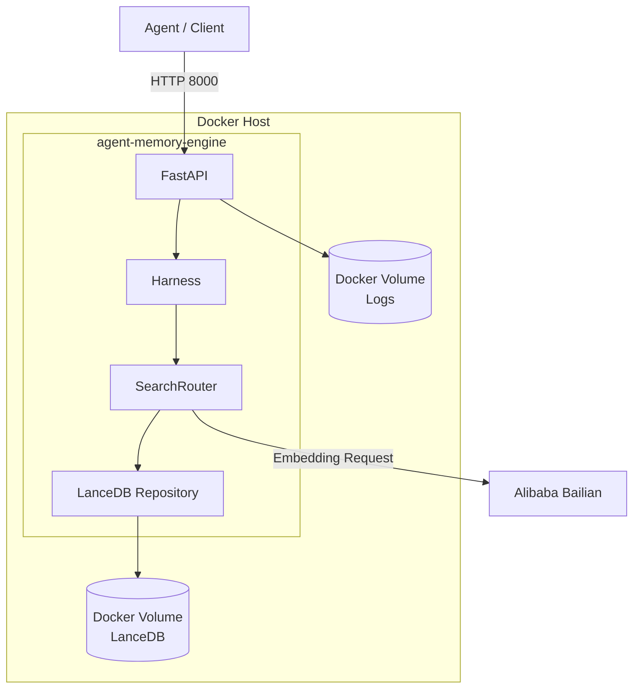
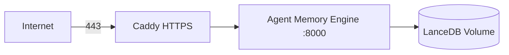
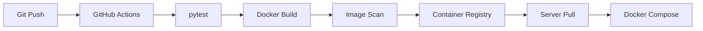
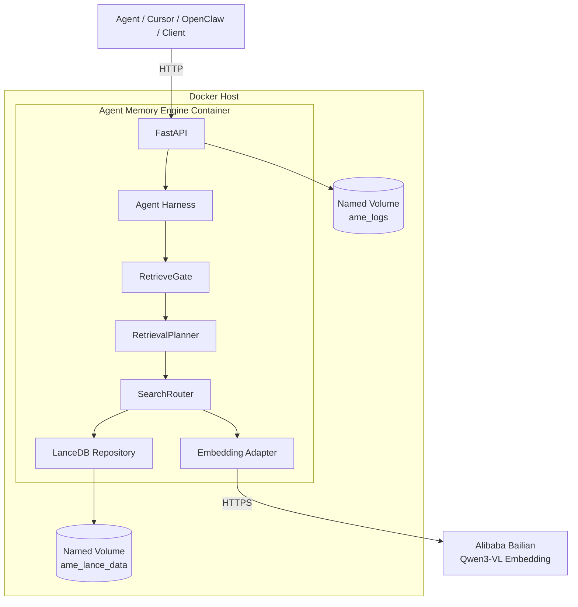
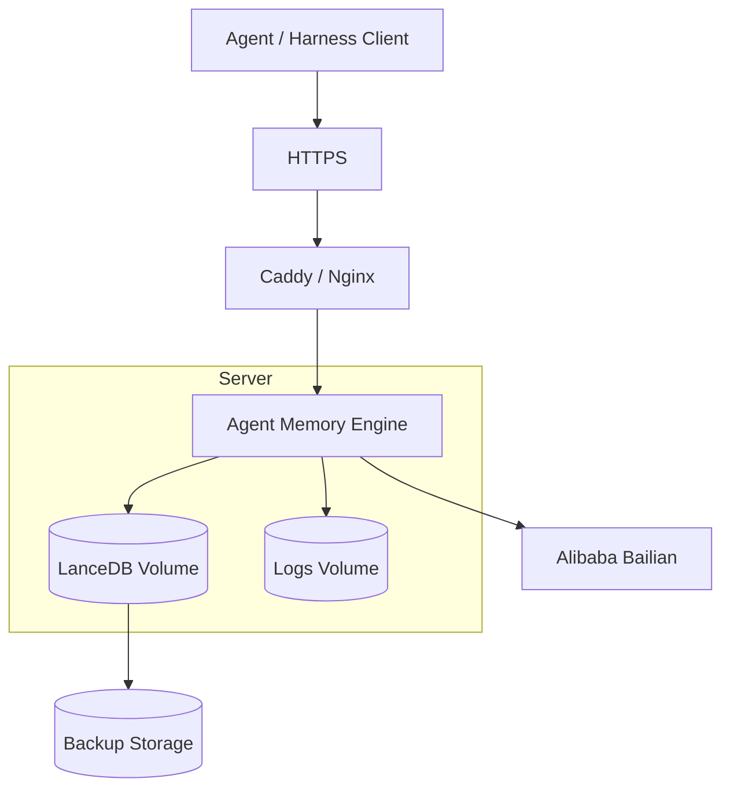

# Agent Memory Engine Docker 部署实施方案

> 适用仓库：`SamhandsomeLee/AgentMemoryEngine`  
> 适用分支：`master`  
> 当前主线：Stage 10  
> 部署目标：将 Agent Memory Engine 的 FastAPI + LanceDB + Qwen3-VL Embedding 主链路容器化，并为后续生产部署、CI/CD、监控和扩展留下稳定边界。

---

## 0. 文档结论

当前项目已经具备直接容器化的基础，但**不能简单理解成“写一个 Dockerfile 然后启动”**。

从当前源码看，真正需要解决的是五个问题：

1. **确定唯一生产入口**
   - HTTP 服务入口是 `app.main:app`
   - 根目录 `main.py` 仍是早期实验入口，不应作为 Docker CMD

2. **保证 LanceDB 数据持久化**
   - 当前默认数据库路径为 `./database/lance`
   - Docker 容器文件系统是临时的，因此必须挂载 volume
   - Stage 10 应只使用 `service_memories`

3. **正确注入百炼/Qwen 配置**
   - 默认 `EMBEDDING_PROVIDER=qwen`
   - 需要 `DASHSCOPE_API_KEY`
   - 需要 `BAILIAN_WORKSPACE_ID` 或显式 `BAILIAN_BASE_URL`
   - 这些密钥不得写入镜像

4. **处理当前依赖边界不清的问题**
   - `requirements.txt` 同时包含 Stage 10 API 和早期多模态实验依赖
   - 第一阶段先保持兼容，避免引入额外代码变更
   - 第二阶段再拆分 `requirements-runtime.txt`

5. **把“进程存活”和“真实可用”区分开**
   - `/v1/health` 当前只返回固定 JSON
   - 它适合作为轻量 liveness
   - 但不验证 LanceDB 可写、Qwen 可用
   - 后续建议增加 readiness

因此，本方案采用：

```text
Phase 1：最小改动 Docker 化
    ↓
Dockerfile + docker-compose.yml + volume + env + healthcheck
    ↓
先保证 API 稳定运行

Phase 2：工程化
    ↓
依赖拆分 + 版本锁定 + 非 root + readiness + backup
    ↓
稳定部署

Phase 3：生产化
    ↓
反向代理 + HTTPS + CI/CD + 镜像仓库 + 监控
```

---

# 1. 当前项目部署对象分析

## 1.1 当前真正的运行主线

当前 Stage 10 HTTP 数据流可以抽象为：

```mermaid
flowchart LR
    U[Agent / Client]
    API[FastAPI<br/>app.main:app]
    ROUTE[/v1 API]
    SERVICE[MemoryService]
    HARNESS[AgentHarness]
    GATE[RetrieveGate]
    PLAN[RetrievalPlanner]
    SEARCH[SearchRouter]
    EMBED[EmbeddingProvider]
    QWEN[Alibaba Bailian<br/>qwen3-vl-embedding]
    REPO[LanceDBMemoryRepository]
    DB[(LanceDB<br/>service_memories)]

    U --> API
    API --> ROUTE

    ROUTE --> SERVICE
    ROUTE --> HARNESS

    HARNESS --> GATE
    GATE --> PLAN
    PLAN --> SERVICE

    SERVICE --> SEARCH
    SERVICE --> REPO

    SEARCH --> EMBED
    SEARCH --> REPO

    EMBED --> QWEN
    REPO --> DB
```

Docker 化实际上要容器化的是左侧这一组：

```text
FastAPI
MemoryService
AgentHarness
SearchRouter
Embedding Adapter
LanceDB Repository
```

但 Qwen/Bailian 仍然是外部云服务：

```text
Docker Container
      │
      │ HTTPS
      ▼
Alibaba Bailian
```

因此当前不需要在 Compose 里再启动一个 embedding 模型容器。

---

# 2. 当前代码中与 Docker 直接相关的事实

## 2.1 服务入口

正确启动方式：

```bash
python -m uvicorn app.main:app --host 0.0.0.0 --port 8000
```

Docker 中必须绑定：

```text
0.0.0.0
```

不能使用：

```text
127.0.0.1
```

原因是：

```text
127.0.0.1
=
仅容器内部可访问

0.0.0.0
=
容器网络接口对外监听
```

最终：

```text
Host:8000
   │
   ▼
Docker port mapping
   │
   ▼
Container:8000
   │
   ▼
uvicorn app.main:app
```

---

## 2.2 服务初始化行为

`app.main` 的 lifespan 在服务启动阶段会调用：

```python
get_memory_service()
```

随后依赖注入链路会构建：

```text
EmbeddingProvider
      ↓
LanceDBMemoryRepository
      ↓
MemoryManager
      ↓
SearchRouter
      ↓
MemoryService
```

这意味着 Docker 启动阶段就会暴露部分配置错误。

例如：

```text
EMBEDDING_PROVIDER=qwen
但没有 DASHSCOPE_API_KEY
```

服务会在初始化 Provider 时失败，而不是等第一条 API 请求才失败。

这是好的行为，因为配置错误可以更早被发现。

---

# 3. LanceDB 持久化设计

这是本次 Docker 化中最重要的部分之一。

当前默认配置：

```dotenv
MEMORY_DB_PATH=./database/lance
MEMORY_TABLE_NAME=service_memories
```

如果直接执行：

```dockerfile
WORKDIR /app
```

那么数据库实际位于：

```text
/app/database/lance
```

如果不挂载 volume：

```text
docker rm container
```

之后数据库也会一起消失。

---

## 3.1 推荐容器内数据目录

不建议继续在容器中使用相对路径：

```text
./database/lance
```

建议显式设置：

```dotenv
MEMORY_DB_PATH=/data/lance
```

于是：

```text
Container
├── /app
│   └── application code
│
└── /data
    └── lance
        └── service_memories
```

代码和数据彻底分离。

---

## 3.2 Compose Volume

推荐：

```yaml
volumes:
  ame_lance_data:
```

服务：

```yaml
volumes:
  - ame_lance_data:/data/lance
```

结构：

```mermaid
flowchart LR
    C[Agent Memory Engine Container]
    D[/data/lance]
    V[(Docker Named Volume<br/>ame_lance_data)]

    C --> D
    D --> V
```

这样：

```bash
docker compose down
```

不会删除数据。

只有：

```bash
docker compose down -v
```

才会删除 volume。

---

# 4. Embedding Provider 部署设计

当前支持：

```text
qwen
mock
```

---

## 4.1 生产环境

推荐：

```dotenv
EMBEDDING_PROVIDER=qwen
EMBEDDING_DIM=1024

QWEN_VL_EMBEDDING_MODEL=qwen3-vl-embedding
QWEN_VL_EMBEDDING_DIMENSION=1024
```

同时提供：

```dotenv
DASHSCOPE_API_KEY=...
BAILIAN_WORKSPACE_ID=...
BAILIAN_REGION=cn-beijing
```

---

## 4.2 本地 Docker 验证

第一次验证 Docker 时建议先使用：

```dotenv
EMBEDDING_PROVIDER=mock
EMBEDDING_DIM=32
MEMORY_DB_PATH=/data/lance_mock
```

原因是 Docker 问题和第三方模型 API 问题应该分开验证。

正确调试顺序：

```text
Docker 容器是否启动
        ↓
FastAPI 是否可访问
        ↓
LanceDB 是否可写
        ↓
CRUD 是否正常
        ↓
Search 是否正常
        ↓
最后接 Qwen
```

而不是：

```text
Docker + LanceDB + Qwen + 网络 + API Key
同时调试
```

---

## 4.3 向量维度不能随意切换

当前 LanceDB 表 schema 在创建时固定：

```text
vector: float32[dimension]
```

例如：

```text
service_memories
vector dimension = 1024
```

之后如果切换：

```dotenv
EMBEDDING_DIM=32
```

继续使用同一个表，会产生维度冲突。

所以必须遵守：

```text
Embedding Model
    │
    ├── dimension
    │
    ▼
LanceDB Table Schema
```

两者必须一致。

### 推荐约定

生产：

```dotenv
MEMORY_DB_PATH=/data/lance
MEMORY_TABLE_NAME=service_memories
EMBEDDING_PROVIDER=qwen
QWEN_VL_EMBEDDING_DIMENSION=1024
```

测试：

```dotenv
MEMORY_DB_PATH=/data/lance_mock
MEMORY_TABLE_NAME=service_memories
EMBEDDING_PROVIDER=mock
EMBEDDING_DIM=32
```

不要混用数据库目录。

---

# 5. 第一阶段：最小改动 Docker 化

目标：

> 不修改核心 Python 业务逻辑，只增加部署文件。

建议新增：

```text
AgentMemoryEngine/
├── Dockerfile
├── docker-compose.yml
├── .dockerignore
├── deploy/
│   └── env/
│       └── production.env.example
│
├── app/
├── memory_engine/
├── storage/
├── requirements.txt
└── ...
```

---

# 6. Dockerfile

第一版建议使用：

```dockerfile
FROM python:3.11-slim

ENV PYTHONDONTWRITEBYTECODE=1 \
    PYTHONUNBUFFERED=1 \
    PIP_NO_CACHE_DIR=1

WORKDIR /app

COPY requirements.txt .

RUN python -m pip install --upgrade pip \
    && pip install -r requirements.txt

COPY . .

RUN mkdir -p /data/lance /app/logs

EXPOSE 8000

CMD [
  "python",
  "-m",
  "uvicorn",
  "app.main:app",
  "--host",
  "0.0.0.0",
  "--port",
  "8000"
]
```

---

# 7. Dockerfile 设计解释

## 7.1 为什么使用 Python 3.11

项目 README 要求 Python 3.10+。

推荐：

```text
Python 3.11
```

原因：

```text
成熟
兼容性较好
性能比 3.10 更好
第三方 AI / Arrow / LanceDB 生态支持成熟
```

暂不建议第一次 Docker 化直接使用最新 Python 大版本。

---

## 7.2 为什么使用 slim

选择：

```text
python:3.11-slim
```

而不是：

```text
python:3.11
```

主要为了减少基础镜像大小。

但是当前项目依赖：

```text
open-clip-torch
sentence-transformers
```

会引入 PyTorch 相关依赖。

所以即使使用 slim：

```text
最终镜像仍可能明显偏大
```

这不是 Dockerfile 的主要问题，而是：

```text
runtime dependencies
        ↓
和实验 dependencies 混在一起
```

后面会单独优化。

---

# 8. .dockerignore

建议新增：

```dockerignore
.git
.gitignore

.env
.env.*

.venv
venv

__pycache__
*.py[cod]

.pytest_cache
.coverage
htmlcov

database
logs

*.log

.idea
.vscode

dist
build
*.egg-info
```

但是如果需要保留：

```text
.env.example
```

则建议：

```dockerignore
.env
.env.production
.env.local
```

而不要直接：

```dockerignore
.env.*
```

否则 `.env.example` 也会被排除。

最终推荐：

```dockerignore
.git
.venv
venv

__pycache__
*.py[cod]

.pytest_cache
.coverage

.env
.env.local
.env.production

database
logs

.idea
.vscode
```

---

# 9. Docker Compose

推荐第一版：

```yaml
services:
  agent-memory-engine:
    build:
      context: .
      dockerfile: Dockerfile

    container_name: agent-memory-engine

    restart: unless-stopped

    env_file:
      - .env

    environment:
      MEMORY_DB_PATH: /data/lance
      LOG_DIR: /app/logs

    ports:
      - "8000:8000"

    volumes:
      - ame_lance_data:/data/lance
      - ame_logs:/app/logs

    healthcheck:
      test:
        [
          "CMD",
          "python",
          "-c",
          "import urllib.request; urllib.request.urlopen('http://127.0.0.1:8000/v1/health', timeout=3)"
        ]
      interval: 30s
      timeout: 5s
      retries: 3
      start_period: 20s

volumes:
  ame_lance_data:
  ame_logs:
```

---

# 10. 为什么暂时只需要一个 Container

当前架构：

```text
Agent Memory Engine
    │
    ├── FastAPI
    ├── Harness
    ├── Search
    ├── LanceDB local
    └── HTTP client
            │
            ▼
        Bailian API
```

所以 Compose 不需要：

```text
PostgreSQL
Redis
Qdrant
Milvus
Elasticsearch
```

目前 LanceDB 是：

```text
embedded database
```

与 SQLite 思路类似：

```text
Python Process
      │
      ▼
local database files
```

因此当前 MVP 最合理的架构是：



---

# 11. 环境变量设计

建议 `.env`：

```dotenv
# ========================================
# Agent Memory Engine
# ========================================

# ---------- Storage ----------
MEMORY_DB_PATH=/data/lance
MEMORY_TABLE_NAME=service_memories

# ---------- Embedding ----------
EMBEDDING_PROVIDER=qwen
EMBEDDING_DIM=1024

QWEN_VL_EMBEDDING_MODEL=qwen3-vl-embedding
QWEN_VL_EMBEDDING_DIMENSION=1024

# ---------- Alibaba Bailian ----------
DASHSCOPE_API_KEY=
BAILIAN_WORKSPACE_ID=
BAILIAN_REGION=cn-beijing

# Optional:
# BAILIAN_BASE_URL=

# ---------- Legacy / Reserved ----------
RERANKER_PROVIDER=qwen

# ---------- Logging ----------
LOG_DIR=/app/logs
AME_LOG_DISABLED=0

# ---------- CLI only ----------
LLM_PROVIDER=deepseek
LLM_API_KEY=
# LLM_BASE_URL=
# LLM_MODEL=
```

---

# 12. Secret 管理原则

禁止：

```dockerfile
ENV DASHSCOPE_API_KEY=sk-xxxx
```

禁止：

```dockerfile
COPY .env /app/.env
```

生产环境的 key 必须在：

```text
Runtime
```

而不是：

```text
Image Build Time
```

正确模型：

```text
Docker Image
      +
Runtime Environment Variables
      +
Persistent Volume
```

镜像本身应该是：

```text
stateless application artifact
```

---

# 13. 构建流程

克隆：

```bash
git clone https://github.com/SamhandsomeLee/AgentMemoryEngine.git
cd AgentMemoryEngine
```

创建环境文件：

```bash
cp .env.example .env
```

修改：

```dotenv
MEMORY_DB_PATH=/data/lance
LOG_DIR=/app/logs
```

填写百炼配置。

构建：

```bash
docker compose build
```

启动：

```bash
docker compose up -d
```

查看：

```bash
docker compose ps
```

日志：

```bash
docker compose logs -f agent-memory-engine
```

---

# 14. 第一次建议使用 Mock Provider 验证

修改：

```dotenv
EMBEDDING_PROVIDER=mock
EMBEDDING_DIM=32
MEMORY_DB_PATH=/data/lance_mock
```

Compose 中 volume：

```yaml
volumes:
  - ame_lance_mock_data:/data/lance_mock
```

然后：

```bash
docker compose up -d --build
```

---

# 15. 健康检查

访问：

```bash
curl http://localhost:8000/v1/health
```

预期：

```json
{
  "status": "ok",
  "stage": 10
}
```

---

# 16. Swagger

浏览器：

```text
http://localhost:8000/docs
```

OpenAPI：

```text
http://localhost:8000/openapi.json
```

---

# 17. CRUD 验收

## 17.1 Create

```bash
curl -X POST http://localhost:8000/v1/memories \
  -H "Content-Type: application/json" \
  -d '{
    "content": "Docker volume should persist LanceDB data",
    "memory_type": "semantic",
    "importance": 0.9,
    "metadata": {
      "project": "AgentMemoryEngine",
      "topic": "docker"
    }
  }'
```

记录返回的：

```text
id
```

---

## 17.2 Search

```bash
curl -X POST http://localhost:8000/v1/memories/search \
  -H "Content-Type: application/json" \
  -d '{
    "query": "LanceDB data persistence",
    "method": "hybrid",
    "top_k": 5,
    "memory_types": ["semantic"],
    "filters": {
      "project": "AgentMemoryEngine"
    }
  }'
```

---

## 17.3 Harness

```bash
curl -X POST http://localhost:8000/v1/agent/prepare-context \
  -H "Content-Type: application/json" \
  -d '{
    "task": "继续之前 AgentMemoryEngine Docker 持久化设计",
    "context": {
      "project": "AgentMemoryEngine"
    }
  }'
```

重点检查：

```text
gate_decision
retrieval_plan
memories
memory_context
```

---

# 18. 最关键的持久化测试

这是 Docker 化完成后必须执行的测试。

### Step 1

写入 Memory。

### Step 2

确认能读取。

### Step 3

停止：

```bash
docker compose down
```

### Step 4

再次启动：

```bash
docker compose up -d
```

### Step 5

重新查询 Memory。

如果仍然存在：

```text
Volume persistence PASS
```

---

# 19. 不要执行的命令

如果数据库需要保留，不要：

```bash
docker compose down -v
```

因为：

```text
-v
=
remove volumes
```

结果：

```text
LanceDB data deleted
```

---

# 20. 日志设计

当前应用已经具备自己的：

```text
jsonl
text
```

文件日志。

建议 Docker 阶段同时保留两条日志渠道：

```text
stdout/stderr
      ↓
docker logs

application logs
      ↓
/app/logs
      ↓
Docker Volume
```

架构：

```mermaid
flowchart LR
    APP[Agent Memory Engine]
    STD[stdout / stderr]
    FILE[/app/logs]
    DOCKER[docker logs]
    VOL[(ame_logs)]

    APP --> STD
    STD --> DOCKER

    APP --> FILE
    FILE --> VOL
```

---

# 21. 第二阶段：拆分 Runtime Dependencies

当前 `requirements.txt` 包含：

```text
lancedb
pyarrow
sentence-transformers
open-clip-torch
Pillow
pypdf
pytest
requests
python-dotenv
fastapi
uvicorn[standard]
pydantic
pydantic-settings
httpx
```

但 Stage 10 API 主线并不直接需要所有早期实验依赖。

建议新增：

```text
requirements-runtime.txt
requirements-dev.txt
requirements-experimental.txt
```

---

## 21.1 Runtime

初步建议：

```text
lancedb
pyarrow
requests
python-dotenv
fastapi
uvicorn[standard]
pydantic
pydantic-settings
httpx
```

注意：

> 最终拆分前仍应执行完整测试，确认任何 import-time 间接依赖。

---

## 21.2 Dev

```text
-r requirements-runtime.txt
pytest
```

---

## 21.3 Experimental

例如：

```text
sentence-transformers
open-clip-torch
Pillow
pypdf
```

---

# 22. 优化后的 Dockerfile

依赖拆分完成后：

```dockerfile
FROM python:3.11-slim

ENV PYTHONDONTWRITEBYTECODE=1 \
    PYTHONUNBUFFERED=1 \
    PIP_NO_CACHE_DIR=1

WORKDIR /app

COPY requirements-runtime.txt .

RUN python -m pip install --upgrade pip \
    && pip install -r requirements-runtime.txt

COPY app ./app
COPY memory_engine ./memory_engine
COPY storage ./storage

RUN mkdir -p /data/lance /app/logs

EXPOSE 8000

CMD [
  "python",
  "-m",
  "uvicorn",
  "app.main:app",
  "--host",
  "0.0.0.0",
  "--port",
  "8000"
]
```

相比：

```dockerfile
COPY . .
```

这会减少：

```text
tests
docs
examples
legacy modules
local artifacts
```

进入生产镜像。

---

# 23. 第三阶段：依赖版本锁定

目前依赖都是：

```text
lancedb
fastapi
pydantic
...
```

没有版本限制。

这会导致：

```text
今天 build
   ≠
三个月以后 build
```

这是生产 Docker 最大的可重复性风险之一。

目标应该变成：

```text
Source Commit
+
Locked Dependencies
+
Docker Base Image
=
Reproducible Image
```

---

## 23.1 推荐方式

可以使用：

```text
pip-tools
```

维护：

```text
requirements-runtime.in
```

生成：

```text
requirements-runtime.txt
```

例如：

```bash
pip-compile requirements-runtime.in
```

然后 Docker：

```bash
pip install -r requirements-runtime.txt
```

---

# 24. 容器安全

MVP 可以先使用 root。

生产建议增加：

```dockerfile
RUN useradd --create-home --uid 10001 appuser \
    && mkdir -p /data/lance /app/logs \
    && chown -R appuser:appuser /app /data

USER appuser
```

最终：

```dockerfile
FROM python:3.11-slim

ENV PYTHONDONTWRITEBYTECODE=1 \
    PYTHONUNBUFFERED=1 \
    PIP_NO_CACHE_DIR=1

WORKDIR /app

COPY requirements-runtime.txt .

RUN python -m pip install --upgrade pip \
    && pip install -r requirements-runtime.txt

COPY --chown=10001:10001 app ./app
COPY --chown=10001:10001 memory_engine ./memory_engine
COPY --chown=10001:10001 storage ./storage

RUN useradd --create-home --uid 10001 appuser \
    && mkdir -p /data/lance /app/logs \
    && chown -R appuser:appuser /app /data

USER appuser

EXPOSE 8000

CMD [
  "python",
  "-m",
  "uvicorn",
  "app.main:app",
  "--host",
  "0.0.0.0",
  "--port",
  "8000"
]
```

实际实现时建议调整 `useradd` 和 COPY 顺序，确保用户在 COPY `--chown` 前已经存在，或者直接使用数字 UID/GID。

---

# 25. Health Check 的局限

当前：

```text
GET /v1/health
```

只返回：

```json
{
  "status": "ok",
  "stage": 10
}
```

所以：

```text
FastAPI alive
```

不等于：

```text
System ready
```

可能出现：

```text
FastAPI OK
LanceDB read-only
```

或者：

```text
FastAPI OK
Bailian network unreachable
```

---

# 26. 推荐增加 Readiness

建议未来增加：

```text
GET /v1/health/live
GET /v1/health/ready
```

---

## 26.1 Live

只验证：

```text
Python process
FastAPI event loop
```

响应：

```json
{
  "status": "ok"
}
```

---

## 26.2 Ready

验证：

```text
MemoryService initialized
LanceDB table accessible
database directory writable
embedding provider configured
```

注意：

不建议每次 readiness 都真正调用一次 Qwen Embedding。

原因：

```text
health check
    ↓
每 30 秒调用模型
    ↓
产生费用 + 外部依赖放大
```

更合理的是：

```text
启动阶段验证配置
运行阶段探测数据库
模型实际请求失败交给应用指标/日志
```

---

# 27. Uvicorn Worker 策略

第一阶段推荐：

```text
1 worker
```

即：

```bash
uvicorn app.main:app
```

不要一开始：

```bash
--workers 4
```

原因包括：

```text
本地嵌入式 LanceDB
+
多个独立 Python worker
+
并发写入
```

会增加存储并发复杂度。

当前 MVP 更适合：

```text
one container
one uvicorn process
```

---

# 28. 横向扩容的边界

未来如果需要：

```text
Container A
Container B
Container C
```

并同时访问：

```text
同一个本地 Docker Volume LanceDB
```

不建议直接这样做。

当前架构更适合：

```text
Single Writer / Single Instance
```

如果未来要求真正横向扩容，应重新评估：

```text
LanceDB Cloud / object storage architecture
```

或：

```text
独立 Vector DB Service
```

而不是简单：

```text
docker compose scale agent-memory-engine=5
```

---

# 29. Reverse Proxy

公网部署建议：

```text
Internet
   │
   ▼
Nginx / Caddy
   │ HTTPS
   ▼
Agent Memory Engine
```

不要直接暴露：

```text
8000
```

到公网。

---

# 30. Caddy 示例

如果希望简单：

```yaml
services:

  agent-memory-engine:
    build: .
    expose:
      - "8000"

  caddy:
    image: caddy:2
    ports:
      - "80:80"
      - "443:443"
```

网络：



---

# 31. API 安全问题

当前 API 包括：

```text
POST /v1/memories
PATCH /v1/memories/{id}
DELETE /v1/memories/{id}
```

但当前没有明显认证层。

因此在增加 Auth 前：

> 不建议直接暴露到公网。

最初可以：

```text
localhost only
```

或：

```text
private VPC
```

或：

```text
reverse proxy basic auth
```

后续再加入：

```text
API Key
JWT
OAuth
mTLS
```

---

# 32. 完整生产 Compose 推荐结构

后续可以演化到：

```yaml
services:
  agent-memory-engine:
    image: ghcr.io/YOUR_ORG/agent-memory-engine:${AME_VERSION}
    restart: unless-stopped

    env_file:
      - .env.production

    environment:
      MEMORY_DB_PATH: /data/lance
      LOG_DIR: /app/logs

    expose:
      - "8000"

    volumes:
      - ame_lance_data:/data/lance
      - ame_logs:/app/logs

    healthcheck:
      test:
        [
          "CMD",
          "python",
          "-c",
          "import urllib.request; urllib.request.urlopen('http://127.0.0.1:8000/v1/health', timeout=3)"
        ]
      interval: 30s
      timeout: 5s
      retries: 3

    networks:
      - backend

  caddy:
    image: caddy:2
    restart: unless-stopped

    ports:
      - "80:80"
      - "443:443"

    volumes:
      - ./Caddyfile:/etc/caddy/Caddyfile:ro
      - caddy_data:/data
      - caddy_config:/config

    depends_on:
      agent-memory-engine:
        condition: service_healthy

    networks:
      - backend

networks:
  backend:

volumes:
  ame_lance_data:
  ame_logs:
  caddy_data:
  caddy_config:
```

---

# 33. Docker 网络原则

只把：

```text
reverse proxy
```

暴露出去。

Agent Memory Engine 使用：

```yaml
expose:
  - "8000"
```

而不是：

```yaml
ports:
  - "8000:8000"
```

区别：

```text
expose
=
Docker network 内访问

ports
=
Host 对外映射
```

---

# 34. 数据备份

LanceDB 数据目录是核心资产。

必须备份：

```text
/data/lance
```

---

## 34.1 Docker Volume Backup

例如：

```bash
docker run --rm \
  -v ame_lance_data:/source \
  -v $(pwd)/backup:/backup \
  alpine \
  tar czf /backup/lance-$(date +%Y%m%d-%H%M%S).tar.gz -C /source .
```

---

## 34.2 Restore

```bash
docker run --rm \
  -v ame_lance_data:/target \
  -v $(pwd)/backup:/backup \
  alpine \
  sh -c "cd /target && tar xzf /backup/lance-backup.tar.gz"
```

恢复前建议先停服务：

```bash
docker compose stop agent-memory-engine
```

避免数据库写入过程中恢复。

---

# 35. 数据升级原则

未来可能修改：

```text
service_memories schema
embedding dimension
metadata structure
```

不能简单：

```text
重新 build Docker image
```

因为：

```text
Image upgrade
≠
Database migration
```

后续应该建立：

```text
migration/
```

例如：

```text
scripts/
└── migrate_memory_v1_to_v2.py
```

---

# 36. 向量模型升级

例如未来：

```text
qwen3-vl-embedding
        ↓
new embedding model
```

如果：

```text
dimension changed
```

或者：

```text
embedding semantic space changed
```

即使 dimension 一样，也不应简单复用原 vector。

正确方式：

```text
Old Table
service_memories_v1
        │
        ▼
Read original content
        │
        ▼
New embedding model
        │
        ▼
service_memories_v2
```

然后切换：

```dotenv
MEMORY_TABLE_NAME=service_memories_v2
```

---

# 37. CI/CD 推荐

最终目标：



---

# 38. CI Pipeline

建议：

```text
1. Checkout
2. Python install
3. pip install
4. pytest
5. docker build
6. image smoke test
7. push registry
```

---

# 39. Docker Smoke Test

CI 中可以使用：

```dotenv
EMBEDDING_PROVIDER=mock
EMBEDDING_DIM=32
MEMORY_DB_PATH=/tmp/lance
AME_LOG_DISABLED=1
```

启动：

```bash
docker run -d \
  --name ame-test \
  -e EMBEDDING_PROVIDER=mock \
  -e EMBEDDING_DIM=32 \
  -e MEMORY_DB_PATH=/tmp/lance \
  -p 8000:8000 \
  agent-memory-engine:test
```

等待后：

```bash
curl --fail http://localhost:8000/v1/health
```

再运行 API smoke test。

这样 CI 不依赖真实 Qwen API Key。

---

# 40. 镜像 Tag 策略

禁止只使用：

```text
latest
```

建议：

```text
agent-memory-engine:0.10.0
agent-memory-engine:git-<short-sha>
```

例如：

```text
agent-memory-engine:git-ee3a1c9
```

部署时才能知道：

```text
服务器究竟运行的是哪一版源码
```

---

# 41. 可观测性演进

当前已经有：

```text
trace
jsonl logging
HTTP request events
repository events
embedding events
```

后续可以逐步加入：

```text
Prometheus
OpenTelemetry
Grafana
```

核心指标建议：

```text
HTTP request latency
HTTP error rate

retrieve gate decision ratio
retrieval route distribution

vector search latency
keyword search latency
hybrid search latency

embedding request latency
embedding error rate

memory write count
memory search count

context chars
retrieved memory count
```

这些指标对 Agent Harness 的实验价值比普通 Web 指标更大。

---

# 42. 推荐的最终目录

Docker 工程化后：

```text
AgentMemoryEngine/
│
├── app/
│
├── memory_engine/
│
├── storage/
│
├── memory/
├── multimodal/
├── experience/
├── hybrid/
│
├── tests/
├── examples/
├── docs/
│
├── deploy/
│   ├── docker/
│   │   ├── docker-compose.yml
│   │   └── docker-compose.prod.yml
│   │
│   ├── caddy/
│   │   └── Caddyfile
│   │
│   └── env/
│       └── production.env.example
│
├── scripts/
│   ├── backup_lancedb.sh
│   └── restore_lancedb.sh
│
├── Dockerfile
├── .dockerignore
│
├── requirements-runtime.in
├── requirements-runtime.txt
├── requirements-dev.txt
│
├── .env.example
└── README.md
```

---

# 43. 本次建议直接提交的最小文件

如果本次目标只是：

> “先把 MVP 放进 Docker 跑起来”

那么只需要提交：

```text
Dockerfile
.dockerignore
docker-compose.yml
```

并对：

```text
.env.example
README.md
```

做少量补充。

不要在第一次 Docker 改造同时：

```text
重构 LanceDB
重构 Adapter
重构 Search
拆分所有历史模块
引入 Kubernetes
引入 Redis
引入 PostgreSQL
```

这些都不是当前 Docker 化的必要条件。

---

# 44. 推荐实施顺序

## Step 1

确认当前源码测试：

```bash
pytest
```

---

## Step 2

增加：

```text
Dockerfile
.dockerignore
docker-compose.yml
```

---

## Step 3

使用：

```dotenv
EMBEDDING_PROVIDER=mock
```

完成 Docker 内离线测试。

---

## Step 4

验证：

```text
health
create
get
search
prepare-context
restart persistence
```

---

## Step 5

切换：

```dotenv
EMBEDDING_PROVIDER=qwen
```

---

## Step 6

验证：

```text
container -> Alibaba Bailian
```

网络和配置。

---

## Step 7

完成 LanceDB volume 备份测试。

---

## Step 8

拆：

```text
requirements-runtime
```

---

## Step 9

锁依赖版本。

---

## Step 10

加入 CI Docker smoke test。

---

# 45. 验收 Checklist

## Container

- [ ] `docker compose build` 成功
- [ ] Container 启动成功
- [ ] Container 不反复 restart
- [ ] Uvicorn 监听 `0.0.0.0:8000`

## API

- [ ] `/v1/health`
- [ ] `/docs`
- [ ] `/openapi.json`
- [ ] Create Memory
- [ ] Get Memory
- [ ] Update Memory
- [ ] Delete Memory
- [ ] Search Memory
- [ ] Prepare Context

## LanceDB

- [ ] `/data/lance` 存在
- [ ] `service_memories` 正常创建
- [ ] Container restart 后数据存在
- [ ] Container recreate 后数据存在
- [ ] `docker compose down` 后数据存在
- [ ] Backup/restore 成功

## Embedding

- [ ] mock provider 正常
- [ ] Qwen provider 正常
- [ ] API Key 未进入 Docker image
- [ ] Workspace 配置正确
- [ ] Embedding dimension 与 LanceDB 一致

## Logging

- [ ] `docker logs` 可观察启动异常
- [ ] application logs 正常写入
- [ ] logs volume 持久化

## Security

- [ ] `.env` 未 commit
- [ ] `.env` 未 COPY 到 image
- [ ] 生产环境不直接公开 8000
- [ ] API 未认证时仅在可信网络使用

---

# 46. MVP Docker 架构最终形态



---

# 47. 后续生产架构



---

# 48. 对当前项目最重要的工程判断

## 判断一：LanceDB 暂时不应该拆成单独 Container

当前 LanceDB 是本地嵌入式存储。

没有必要制造：

```text
FastAPI Container
    ↓
LanceDB Container
```

这种不存在的服务边界。

当前最正确的是：

```text
FastAPI Process
    ↓
LanceDB Library
    ↓
Persistent Volume
```

---

## 判断二：不要把 Docker 当成“虚拟机”

容器应该尽量只有：

```text
application process
```

因此不用：

```text
systemd
supervisor
ssh server
cron
```

当前 container 只运行：

```text
uvicorn
```

即可。

---

## 判断三：现阶段最先优化的不是 Kubernetes

这个项目当前真正的核心风险仍然是：

```text
Retrieval correctness
Memory schema evolution
Embedding space management
Harness observability
Data persistence
```

而不是：

```text
cluster scheduling
```

因此：

```text
Docker Compose
```

比：

```text
Kubernetes
```

更匹配 MVP 阶段。

---

## 判断四：容器化反而会帮助后续 Harness 实验

容器化之后可以固定：

```text
code
dependency
configuration
database volume
```

这样在比较：

```text
RetrieveGate A
vs
RetrieveGate B
```

或者：

```text
Routing Policy A
vs
Routing Policy B
```

时，可以减少环境变化带来的噪声。

未来可以做到：

```text
same dataset
same embedding
same container base
same test workload
         ↓
only change retrieval policy
```

这对 Agent Harness 的 A/B Test 很重要。

---

# 49. 建议本次 Docker PR 的范围

建议 PR 名称：

```text
feat(deploy): add Docker deployment for Stage 10 API
```

建议包含：

```text
Dockerfile
.dockerignore
docker-compose.yml
.env.example update
README Docker section
```

明确不包含：

```text
业务逻辑重构
retrieval algorithm change
database schema migration
authentication
Kubernetes
```

这样 PR 可以保持：

```text
small
reviewable
reversible
```

---

# 50. 实施优先级

## P0

必须完成：

```text
Dockerfile
Compose
Volume
Env
Healthcheck
Smoke Test
Persistence Test
```

## P1

紧接着完成：

```text
runtime requirements split
dependency pinning
non-root
backup
CI Docker test
```

## P2

进入真正服务化时：

```text
readiness
authentication
HTTPS reverse proxy
metrics
image registry
automated deployment
```

## P3

只有出现真实需求后：

```text
horizontal scaling
remote vector storage
orchestration
Kubernetes
```

---

# 51. 最终实施目标

本次 Docker 化完成后，项目应该达到：

```text
git clone
   │
   ▼
prepare .env
   │
   ▼
docker compose up -d
   │
   ▼
Agent Memory Engine available
```

同时满足：

```text
代码可替换
配置可注入
数据库可持久
日志可追踪
镜像可重复构建
环境可复现
```

这才是 Docker 化对 Agent Memory Engine 的真正价值。

---

# 附录 A：推荐第一版 Dockerfile

```dockerfile
FROM python:3.11-slim

ENV PYTHONDONTWRITEBYTECODE=1 \
    PYTHONUNBUFFERED=1 \
    PIP_NO_CACHE_DIR=1

WORKDIR /app

COPY requirements.txt .

RUN python -m pip install --upgrade pip \
    && pip install -r requirements.txt

COPY . .

RUN mkdir -p /data/lance /app/logs

EXPOSE 8000

CMD [
  "python",
  "-m",
  "uvicorn",
  "app.main:app",
  "--host",
  "0.0.0.0",
  "--port",
  "8000"
]
```

---

# 附录 B：推荐第一版 docker-compose.yml

```yaml
services:
  agent-memory-engine:
    build:
      context: .
      dockerfile: Dockerfile

    container_name: agent-memory-engine
    restart: unless-stopped

    env_file:
      - .env

    environment:
      MEMORY_DB_PATH: /data/lance
      LOG_DIR: /app/logs

    ports:
      - "8000:8000"

    volumes:
      - ame_lance_data:/data/lance
      - ame_logs:/app/logs

    healthcheck:
      test:
        [
          "CMD",
          "python",
          "-c",
          "import urllib.request; urllib.request.urlopen('http://127.0.0.1:8000/v1/health', timeout=3)"
        ]
      interval: 30s
      timeout: 5s
      retries: 3
      start_period: 20s

volumes:
  ame_lance_data:
  ame_logs:
```

---

# 附录 C：推荐 .dockerignore

```dockerignore
.git

.venv
venv

__pycache__
*.py[cod]

.pytest_cache
.coverage

.env
.env.local
.env.production

database
logs

.idea
.vscode
```

---

# 附录 D：Docker 验收命令

```bash
docker compose build

docker compose up -d

docker compose ps

docker compose logs -f agent-memory-engine

curl http://localhost:8000/v1/health

curl http://localhost:8000/openapi.json
```

持久化测试：

```bash
docker compose down
docker compose up -d
```

确认之前 Memory 仍然存在。

---

# 附录 E：源码依据

本方案基于当前仓库实际代码结构制定，重点参考：

```text
README.md
app/main.py
app/config.py
app/api/dependencies.py
app/api/routes.py
app/adapters/embedding.py
app/infrastructure/lancedb_repository.py
storage/lance.py
memory_engine/providers/bailian.py
requirements.txt
.env.example
pyproject.toml
tests/test_stage9_api.py
tests/test_stage10_api.py
```

核心事实：

```text
HTTP entrypoint:
app.main:app

Stage:
10

Storage:
LanceDB

Stage 10 table:
service_memories

Default DB:
./database/lance

Production embedding:
qwen3-vl-embedding

Offline embedding:
mock

HTTP health:
GET /v1/health
```

---

# 附录 F：下一步建议

Docker 化本身建议按照下面三个提交实施：

```text
Commit 1
feat(deploy): add Dockerfile and compose

Commit 2
test(deploy): add Docker smoke and persistence verification

Commit 3
refactor(deps): split runtime and experimental dependencies
```

不要把三件事情混成一个大提交。

这样后续一旦出现：

```text
Docker build regression
```

可以快速判断问题来自：

```text
deployment
dependency optimization
or business code
```

而不是重新分析整个系统。
